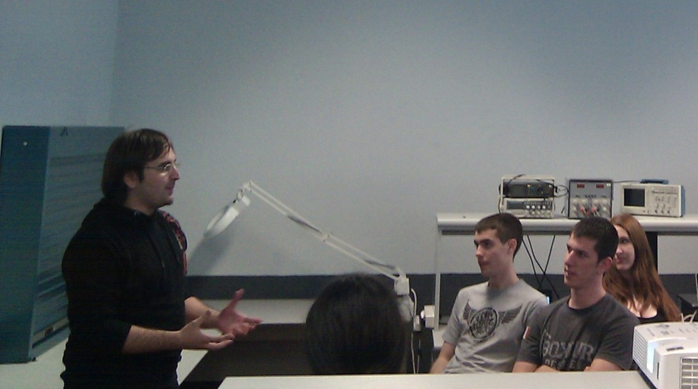
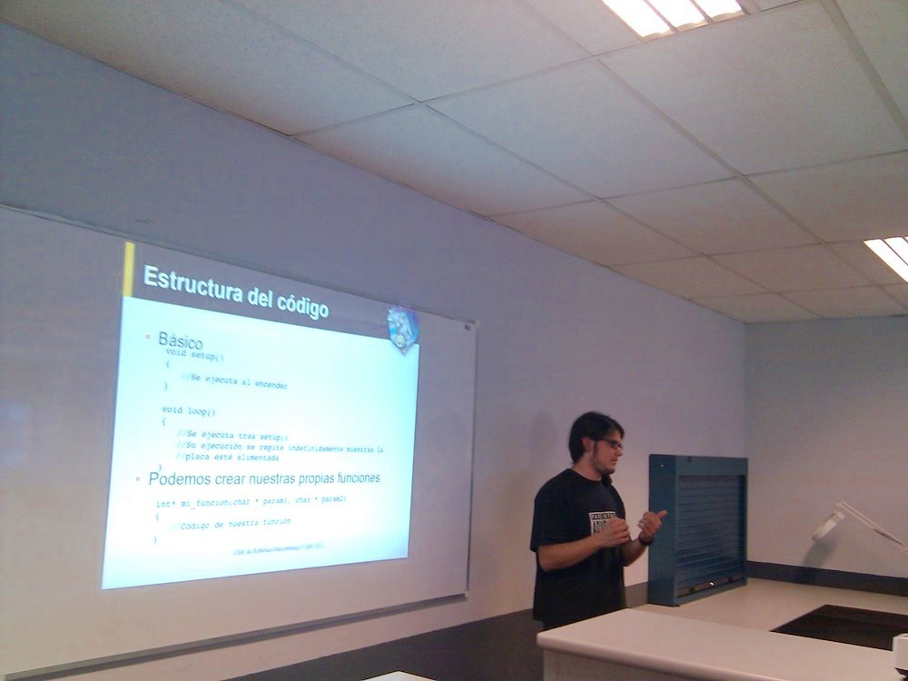
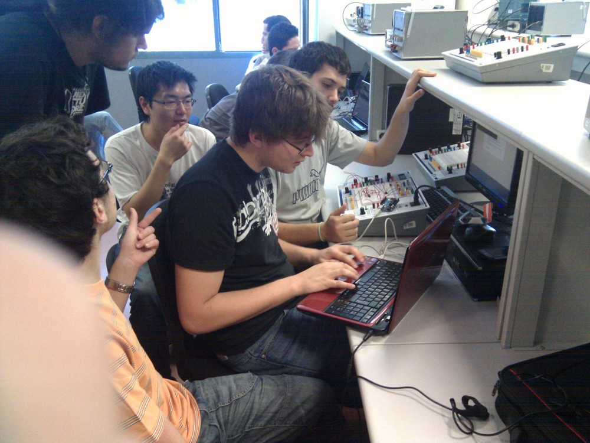
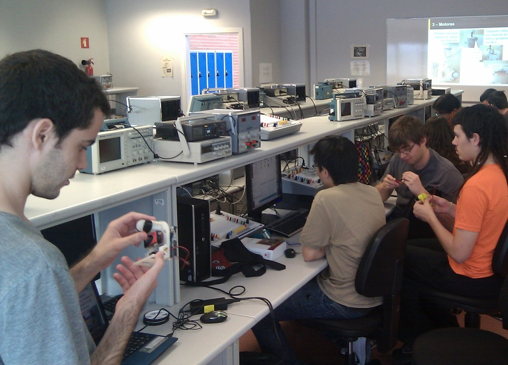
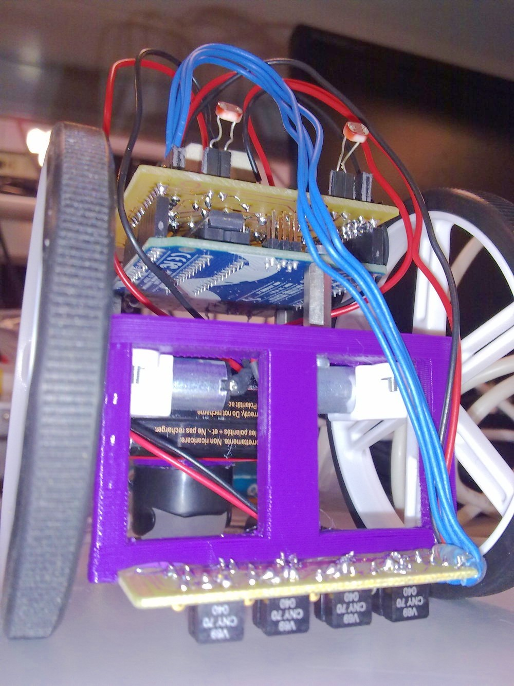
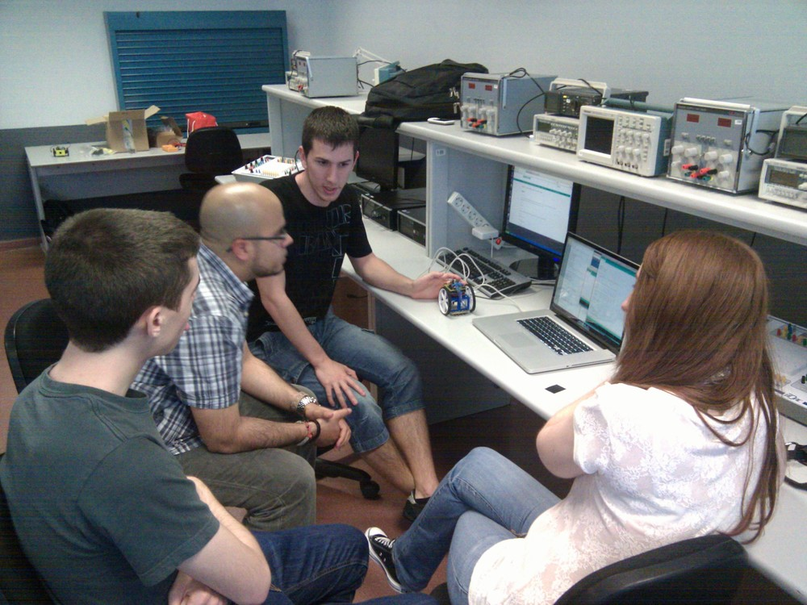
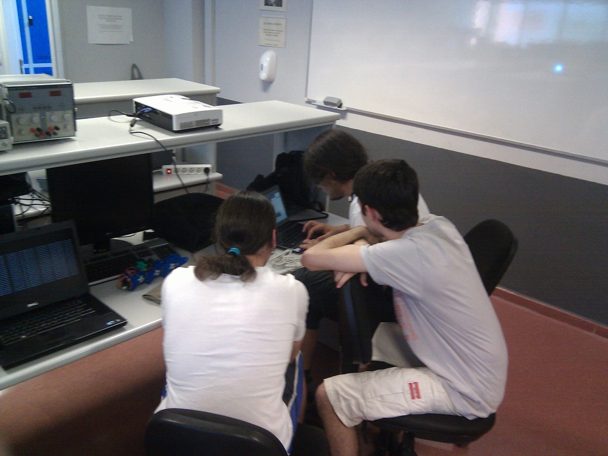
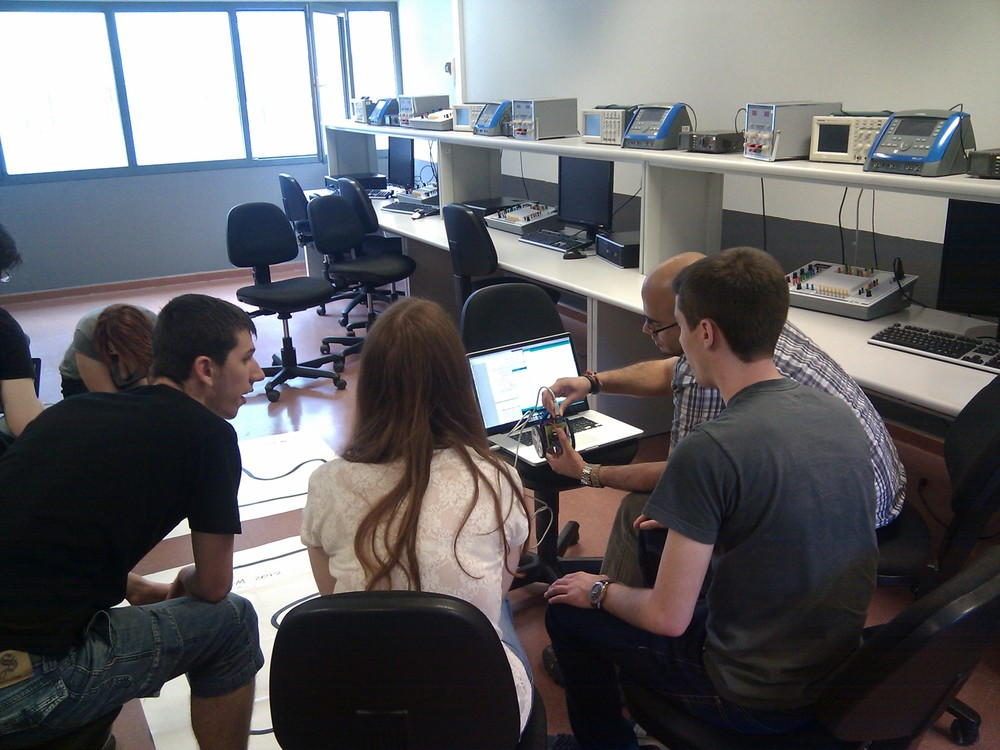
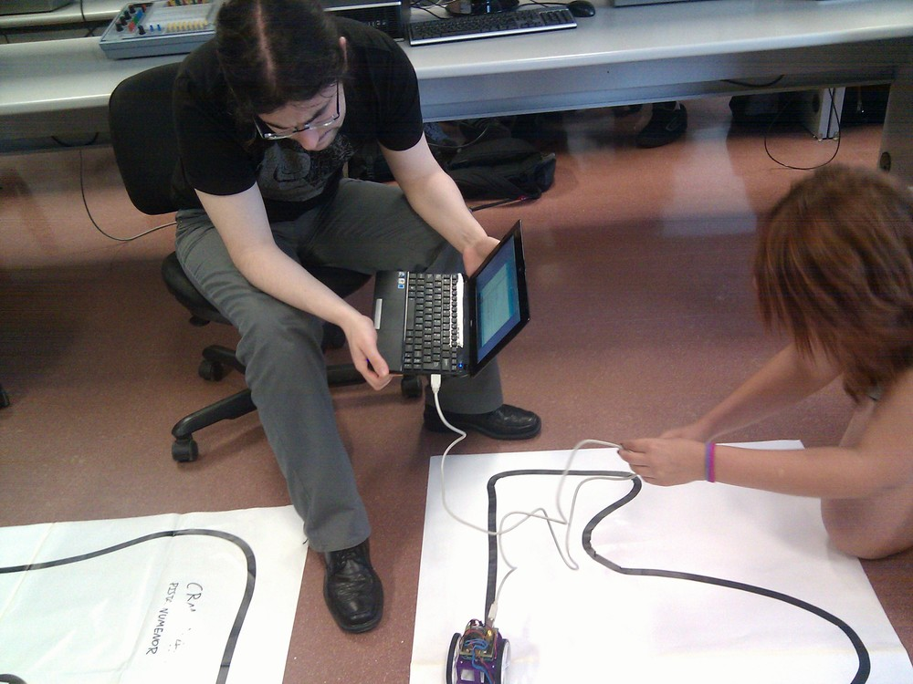

# Taller de introducción a la robótica con el robot HKTR-9000

En Mayo de 2012, Lucas Polo López, Miguel Gargallo Vázquez y Carlos García Saura organizamos desde el Club de Robótica y Mecatrónica un taller de iniciación a la robótica, para el cual necesitamos diseñar un printbot usando los componentes de los que ya disponíamos: el HKTR-9000  

**MEMORIA-RESUMEN DEL TALLER:** [PDF](MEMORIA_ResumenTallerArduino2012.pdf), [ODT](MEMORIA_ResumenTallerArduino2012.odt)  

Documentación
--

* Control Proporcional-Derivativo (PD) para un Siguelineas ([PDF](Control_PD_Siguelineas.pdf), [ODT](Control_PD_Siguelineas.odt))  
* Especificaciones Arduino shields CRM y CNY70 ([PDF](Especificaciones_shields_CRM_y_CNY70.pdf))  
* Ejercicios de la sesión #1 ([PDF](taller_arduino_2012_Ejercicios_S1.pdf), [soluciones](soluciones))  
* Ficheros de diseño del robot: [Thingiverse](http://www.thingiverse.com/thing:23593), [mirror](https://github.com/carlosgs/carlosgs-designs/tree/master/Arduino-based-printbot-HKTR-9000)

Diapositivas:  

* Diapositivas de la sesión #1: Introducción ([PDF](taller_arduino_2012_sesion_1_introduccion.pdf))  
* Diapositivas de la sesión #2: CNY70 y L293 ([PDF](taller_arduino_2012_sesion_2_CNY70yL293.pdf))  
* Diapositivas de la sesión #3a: Robot HKTR-9000 ([PDF](taller_arduino_2012_sesion_3a_HKTR-9000.pdf))  
* Diapositivas de la sesión #3b: Ensamblado del kit ([PDF](taller_arduino_2012_sesion_3b_ensambladoKit.pdf))  

Fotos del taller (23-28 mayo 2012)
--
Día 1:  
  
  
  

Día 2:  
  
  

Día 3:  
  
  
  
  

