Desde el 29 de Octubre de 1997, existe como tal esta Asociación, con el apoyo de la dirección de la Escuela Técnica Superior de Informática de la UAM (actualmente Escuela Politécnica Superior de la UAM). [Eduardo Boemo](http://arantxa.ii.uam.es/~ivan/) organizó un curso de formación en mecatrónica, de forma extra-académica, a principios del mes de Julio de 1997. El curso concluyó con la organizacion del "1º Abierto de Mecatrónica Comunidad de Madrid", el Martes 28 de Octubre de 1997. A él acudieron dos diseños de la E.T.S. Telecomunicaciones de la UPM, uno de la Facultad de Físicas de la UNED, uno de la Escuela de Informática ICAI y seis por parte de la ETSI-UAM. Todos los participantes, e incluso el público que asistió, quedaron muy satisfechos del resultado, y además, con ganas de volver a repetir la experiencia. **De ahí nació el Club.**
Entre los primeros miembros del CRM-UAM (período 1997-2008) estuvieron [Andrés Prieto Moreno](http://www.iearobotics.com/wiki/index.php?title=Andr%C3%A9s_Prieto-Moreno), [Juan González Gómez](http://www.iearobotics.com/wiki/index.php?title=Juan_Gonzalez:Main), Juan Manuel Zapata, Alberto Calvo, Daniel Álvarez, Antonio Carballo e [Iván González](http://arantxa.ii.uam.es/~igonzale/), entre otros, con apoyo del profesor [Guillermo González de Rivera](http://arantxa.ii.uam.es/~gdrivera/).

De 2009 a 2011 fue [Héctor David Ménendez](https://dblp.org/pid/45/9854) quien tomó las riendas de la asociación, promoviendo multitud de talleres de Arduino e iniciativas tan interesantes como el gran *Encuentro de Estudiantes por la Ciencia y la Cultura* (organizado junto con [David Camacho Fernández](http://arantxa.ii.uam.es/~dcamacho/)).
De 2012 a 2020 [muuuchas personas](../junta) seguimos la tradición del CRM al que agradecemos haber especializado y mejorado nuestras carreras ¡Como mejor se aprende es enseñando! 🦾

Desde 2023, tras un parón por el COVID-19 y la reforma del local, el club continúa mejorando la vida universitaria en la Escuela Politécnica Superior, promoviendo la creatividad y los proyectos de todo el que se apunta. Y queremos seguir creciendo... 🎉

**Como ves nos mola mucho participar en eventos, puedes cotillear tambien: [Así vivimos la OSHWDem 2016](../historia/eventos/2016_OSHWDem/), [Fotos de la ArduParty 2014](../actividades/2014_ArduParty/), [Fotos del Taller de introducción a la robótica con el robot HKTR-9000](../actividades/2012_taller_arduino/). ¿Quieres mas fotos? Las tenemos en [el blog](/blog) ¡¡Bienvenidx al club!!** 😄

Robots que han pasado por el CRM
--
_Hay muchas más ¡Recuerda añadir tus robots!_

* (2022) **Máquina arcade** (David, Carlos y Pablo). ¡Por finn terminamos la máquina arcade! :D

<table border="0" width="100%">
  <tr>
    <td width="40%">
      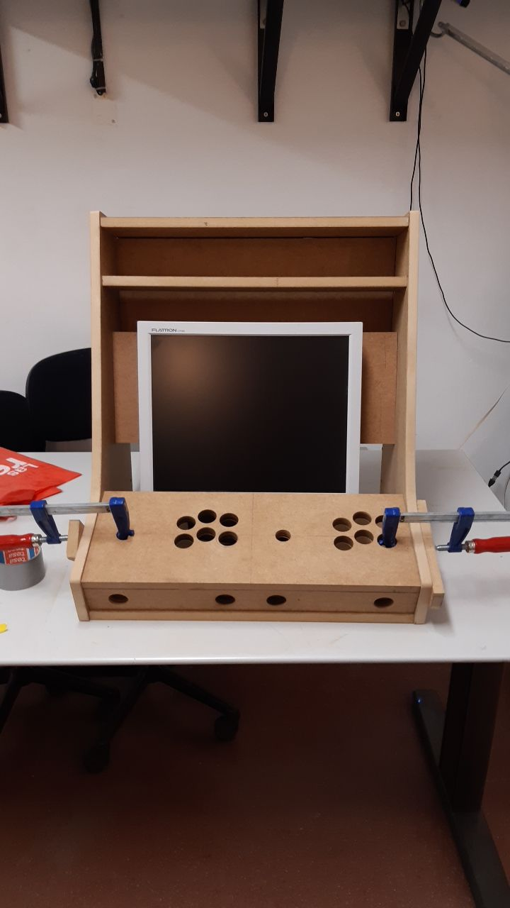 
    </td>
    <td width="60%">
      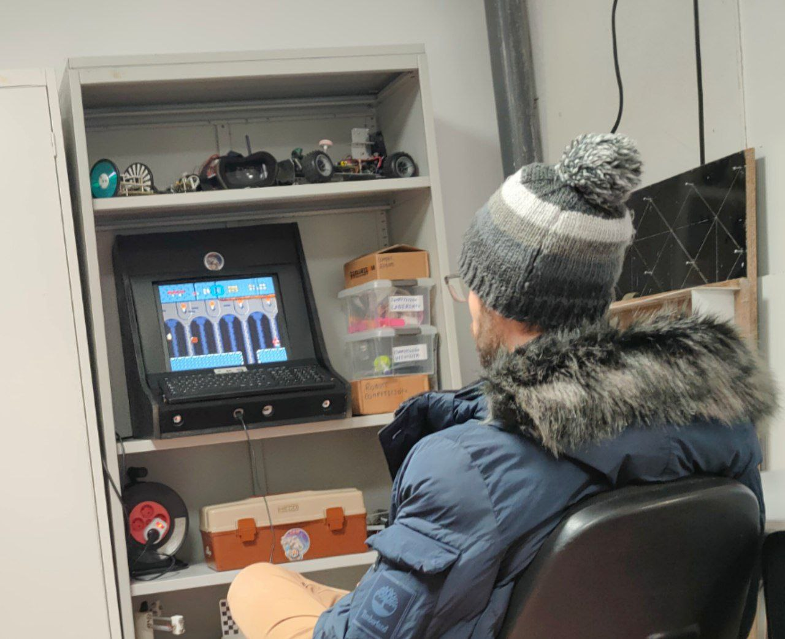 
    </td>
  </tr>
</table>

* (2018) **[VisionRace](https://github.com/CRM-UAM/VisionRace)** (Cristian Tatu). Robot siguelineas que utiliza una camara con vision artificial para mapear la pista ¡Ganó el 2º puesto en velocidad de la OSHWDem!

<table border="0" width="100%">
  <tr>
    <td width="40%">
      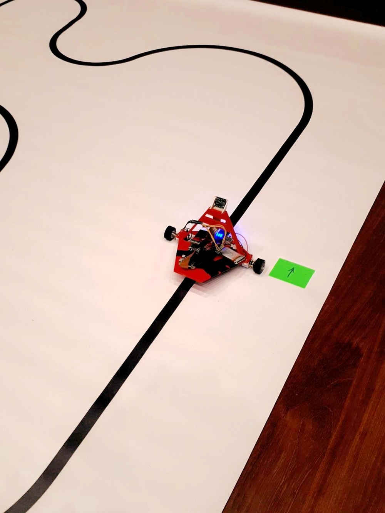 
    </td>
    <td width="60%">
      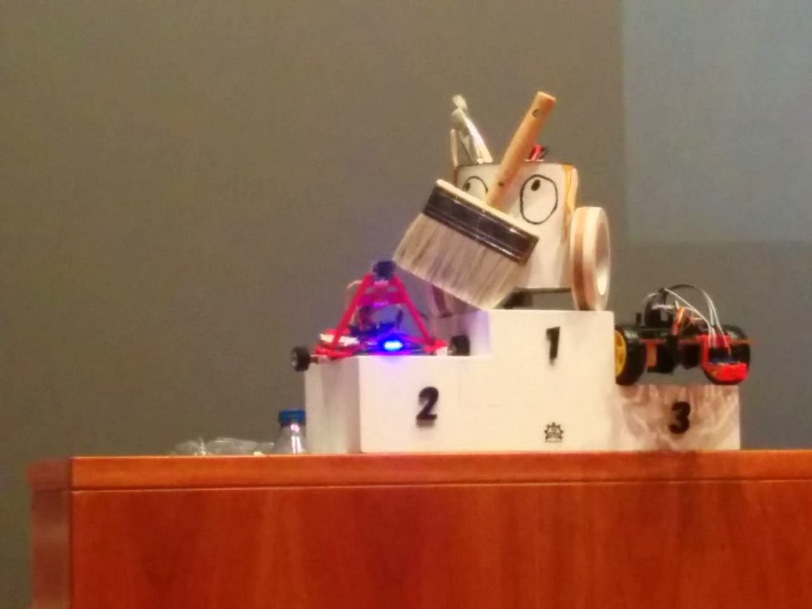 
    </td>
  </tr>
</table>

* (2018) **[Socava-bot](https://github.com/CRM-UAM/Socavabot) y [Ceporro-bot](https://github.com/CRM-UAM/Ceporro-Bot)**. Robots de combate que llevamos otro año a la OSHWDem Coruña... Sip, eso es un cuchillo pegado con celo, y si, eso es un taladro que gira a alta velocidad, pues fueron todo un exito 🎉

<table border="0" width="100%">
  <tr>
    <td width="40%">
       
    </td>
    <td width="60%">
       
    </td>
  </tr>
</table>

* (2016 y 2017) **[Cuñaobot](https://github.com/CRM-UAM/Cuniaobot-2.0)** (Eduardo Hilario y David Ramírez). Robot de combate hecho de metal reforzado. Se controlaba por TELNET, había que pulsar una tecla y luego ENTER, continuamente. Incluso con eso ganó algunas batallas. Dale al enter Edu!!

 

* (2015-2018) **[CRMaze](https://github.com/CRM-UAM/CRMaze) y [DELS](https://github.com/CRM-UAM/micromouse-DELS)** (Víctor Uceda, Carlos García). Varias versiones de nuestros robots laberinto ganaron premios en la OSHWDem Coruña. ¿Dónde Está La Salida? D.E.L.S. 😉

<table border="0" width="100%">
  <tr>
    <td width="40%">
       
    </td>
    <td width="40%">
       
    </td>
    <td width="20%">
       
    </td>
  </tr>
</table>

* (2017) **[Romualdo](https://github.com/CRM-UAM/Romualdo-HackUPC2017)** Con este robot tan majo participamos en el HACKUPC de Barcelona organizado por la Universidad Politecnica de Cataluña 💅

<iframe width="560" height="315" src="https://www.youtube-nocookie.com/embed/HHxEgBvJt8c" title="YouTube video player" frameborder="0" allow="accelerometer; autoplay; clipboard-write; encrypted-media; gyroscope; picture-in-picture" allowfullscreen></iframe>

* (2016) **[Phogo](https://github.com/CRM-UAM/Phogo)** Robot educativo que usamos en varios talleres organizados por la UAM, ¡también los llevamos a la OSHWDem Coruña!

<table border="0" width="100%">
  <tr>
    <td width="50%">
       
    </td>
    <td width="50%">
       
    </td>
  </tr>
</table>

* (2013-2018) **Véctor 9000** (Víctor Uceda, Carlos García) Participante en Cosmobot'13, categoría velocistas. *La categoría velocistas consiste en trazar en el suelo una línea cerrada que deben seguir los robots. Gana el robot que complete el recorrido en el menor tiempo posible*. [**vídeo**](https://www.youtube.com/watch?v=wgSMBDEtGO0)  

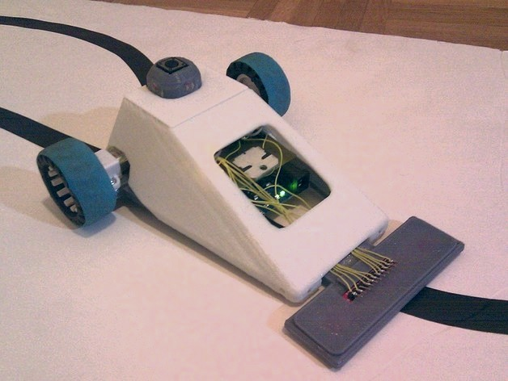
 

* (2012) **HKTR-9000** (Lucas Polo, Miguel Gargallo, Carlos García) Diseñado a partir del PolillaBot y utilizado en el [Taller de introducción a la robótica 2012](../actividades/2012_taller_arduino). El nombre HKTR (*Héctor*) es en honor de Héctor Ménendez, ex-presidente del CRM-UAM. *El HKTR-9000 dispone de sensores de línea, de luz, y de distancia, así como LEDs y un altavoz. De este modo se puede programar para seguir fuentes luminosas, esquivar obstáculos y seguir una línea trazada en el suelo.*  

 

* (2011) **ArduSnake**, un robot modular de tipo "serpiente" con el cuerpo impreso en 3D (módulos [REPY1](http://www.thingiverse.com/thing:13442)) y electrónica donada por el diseñador Juan González (Obijuan). [**Foto de las piezas**](robots/2012_ArduSnake/2012-04-18 18.51.13_ImpresoraHalconMilenario.jpg) siendo fabricadas por [Halcón Milenario](http://www.reprap.org/wiki/Clone_wars:Impresora_Halc%C3%B3n_Milenario)  

 

* (2011) **PolillaBot** (Miguel Gargallo, Lucas Polo, Álvaro Pérez, Carlos Garcia). *Éste robot nos sirvió de iniciación a los sensores de luz, su función era dirigirse hacia las fuentes luminosas situadas a su alrededor*  

 

* (2008) Robot [**FlatBot**](http://www.iearobotics.com/wiki/index.php?title=Robot_FlatBot) (Andrés Prieto-Moreno). Utilizado en el [Taller FlatBot](http://www.iearobotics.com/wiki/index.php?title=Taller_FlatBot) de la Campus Party 08. *Como puede apreciarse, se trata de una plataforma móvil donde situar un ordenador portátil a modo de "cerebro" controlador del robot*  

 

* (2008) Robot **Johny** para el concurso de robots Lego de la Campus Party 08  

 

* (2005) Rastreador **Slayer**, con tracción delantera y cabeza giratoria. Participó en Robolid'05 por primera vez. **Ganador de la categoría rastreadores en Robolid'06**. (Daniel Álvarez y Alberto Calvo) Vídeos: [**en el CRM (I)**](https://www.youtube.com/watch?v=koTuxa8mScI), [**en el CRM (II)**](https://www.youtube.com/watch?v=BRsTaI17uao), [**en la Campus Party'08**](https://www.youtube.com/watch?v=QCTAsrCcZpA)  

 

* (2006) Robot de sumo **Margarita**, **5ª posición en Robolid'06**. *El objetivo de la categoría "sumo" es expulsar al robot contrincante del ring*. ([video](https://www.youtube.com/watch?v=l2qdEMfkfEo))  

 

* (circa 2004) **Queen-Mary**, otro rastreador que usa CDs como ruedas (Daniel Álvarez y Alberto Calvo). [**Vídeo de Queen Mary en el CRM**](https://www.youtube.com/watch?v=7RbjuzbLHUs)  

 

* (2005) [**Skybot**](http://www.iearobotics.com/wiki/index.php?title=Skybot) (Andrés Prieto-Moreno, Juan González Gómez, Ricardo Gómez). Utilizado en multitud de talleres docentes en la Universidad Autónoma de Madrid y en eventos de la Campus Party. Robot antecesor del [**MiniSkyBot**](http://www.thingiverse.com/thing:7989), **el primer robot libre e imprimible del mundo**.  

 

* (2004) Hexápodo **Melanie**, [**Cube Revolutions**](http://www.iearobotics.com/wiki/index.php?title=Cube_Revolutions) (un robot modular de tipo oruga) y **Papón**.  

 

* (circa 2004) Queen-Mary y robot anónimo. Ambos son robots seguidores de línea. [vídeo de Queen Mary en Hispabot'04](https://www.youtube.com/watch?v=Af-piKdG3yk)  

 

* (2003) [**OBSERVER**](https://web.archive.org/web/20030821212619id_/http://www.ii.uam.es/~mecatron/index.php3?seccion=4&pagina=6). El microbot CRM-Observer fue especialmente construido con motivo de la IV Feria "Madrid por la Ciencia", en la que el CRM tuvo la oportunidad de participar representando a la Escuela Politécnica Superior de la UAM. Tras el diseño de [BARTOLO](https://web.archive.org/web/20030821212209id_/http://www.ii.uam.es/~mecatron/index.php3?seccion=4&pagina=7) y dada la complejidad de su manejo, en el CRM teníamos intención de desarrollar un pequeño robot que tuviera las mismas características de Bartolo pero de un tamaño y velocidad más reducidas. De este modo, es posible controlar el robot aunque no lo estemos viendo, ya que podemos manipularlo con la información recibida de la mini-cámara. Aquí teneís un ejemplo de como se ve:

<table border="0" width="100%">
  <tr>
    <td width="40%">
      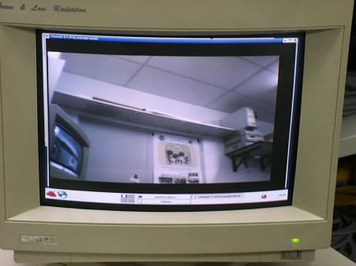 
    </td>
    <td width="60%">
       
    </td>
  </tr>
</table>

* (2002) **Mach I**, un robot seguidor de línea, participante en Alcabot'02 (Antonio Carballo)  

 

* (2001) [**CORTOCIRCUITO**](https://web.archive.org/web/20040105071722id_/http://www.ii.uam.es/%7Emecatron/index.php3?seccion=3&pagina=5). Algunas semanas antes de la ChampionBot, en el CRM habíamos empezado a trabajar en temas de visión artificial. Se trataba de cosas muy sencillas pero nos dimos cuenta de que existía la posibilidad de que con ayuda de un ordenador, un robot pudiera seguir una línea negra. Solo necesitábamos establecer el sistema de envío de las imágenes al PC y las órdenes adecuadas al robot. Aunque ya era factible el uso de un cable, decidimos seguir con la idea de usar transmisión radio y utilizamos nuestro protocolo de comunicación. ¡Lo cierto es que fue un éxito rotundo!

<table border="0" width="100%">
  <tr>
    <td width="40%">
       
    </td>
    <td width="60%">
       
    </td>
  </tr>
</table>

* (2001) **Sauromón**, el robot de Ramón que está sentado en el sillón. Se comportó como un campeón en [la competición](https://web.archive.org/web/20031112235903id_/http://www.sec.upm.es/agustin/album_fotos/champion01/participantes.htm) :)

<table border="0" width="100%">
  <tr>
    <td width="50%">
      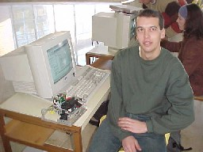 
    </td>
    <td width="50%">
      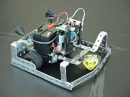 
    </td>
  </tr>
</table>

* (2001-¿?) **[Coche RC "BARTOLO"](https://github.com/CRM-UAM/coche-RC)** El robot que nos jubirará a todos. Bartolo era inicialmente un coche teledirigido que nos cedió el Grupo de Neurocomputación Biológica de la EPS. Lleva con nosotros [¡desde 2001!](https://web.archive.org/web/20030821212209id_/http://www.ii.uam.es/~mecatron/index.php3?seccion=4&pagina=7) y cada año tiene nuevas modificaciones 😆

<table border="0" width="100%">
  <tr>
    <td width="50%">
       
    </td>
    <td width="50%">
       
    </td>
  </tr>
</table>

Fotos de los eventos en los que hemos estado
--

Feria de las Asociaciones de la UAM 2015 (EPS Cantoblanco)
==

<a href="../blog/2015/12/15/FeriaDeLasAsociacionesUAM.html"> <b>Entrada en nuestro blog</b></a>

V Jornada GMV de Robótica 2015 (Tres Cantos)
==

<table border="0" width="100%">
  <tr>
    <td width="55%">
       
      Demostración de los robots <i>Foxiris</i> de GMV (izquierda), <i>MiR100</i> de Robotplus (al fondo) y <i>Aunav</i> de Proytecsa (derecha). <a href="../blog/2015/11/26/VjornadaGMVrobotica.html"><b>Entrada en nuestro blog</b></a>
    </td>
    <td width="60%">
       
      Miembros del CRM ganaron el concurso <i>"Concurrent Design Facility (CDF) for Robotics"</i> junto con estudiantes de la UPM.
    </td>
  </tr>
</table>

OSHWDem 2015 (A Coruña)
==

<table border="0" width="100%">
  <tr>
    <td width="40%">
      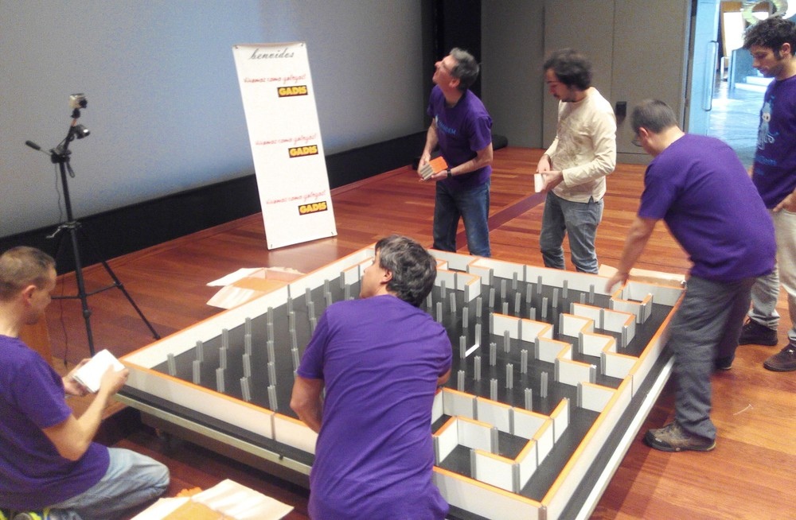 
    </td>
    <td width="60%">
      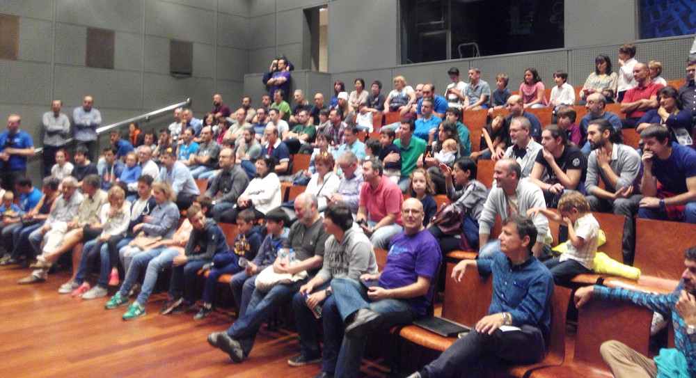 
    </td>
  </tr>
</table>

Víctor y Carlos construyeron el robot [**CRMaze**](https://github.com/CRM-UAM/CRMaze) para participar en el concurso de resolución de laberintos (*"micromouse"*) de la OSHWDem 2015. [**Entrada en nuestro blog**](../blog/2015/11/07/OSHWDem.html)

Campus Party EU 2013 (Londres)
==

<table border="0" width="100%">
  <tr>
    <td width="50%">
       
      A la izquierda Ángel Pérez, y a la derecha Víctor Uceda y Erik Velasco
    </td>
    <td width="50%">
       
      Miembros del CRM ganaron el mini-concurso de robótica VEX
    </td>
  </tr>
</table>

Cosmobot 2013 (Alcobendas)
==

 
Juan González, que vino a visitarnos, y el UAM-Team: Carlos García y Víctor Uceda. El robot es el velocista [Véctor 9000](https://www.youtube.com/watch?v=wgSMBDEtGO0)

Reunión del Club en 2011 :-)
==
 

Fila superior: Lucas Polo, Miguel Gargallo, Carlos García, Raquel Villena, Víctor Hugo García, Sandra Jurado, Ester Vicario y Miriam Esteban. Fila inferior: Álvaro Pérez, Víctor López Juan, Víctor Uceda y Antonio Ortega

Campus Party 2006
==

<table border="0" width="100%">
  <tr>
    <td width="33%">
       
       
    </td>
    <td width="67%">
       
    </td>
  </tr>
</table>

Sup-izq: Alejandro Alonso (autor de Melanie) y Andrés Prieto Moreno. [**Vídeo de la Hormiga Benita (construida en 1996)**](https://www.youtube.com/watch?v=5pRC8NfJ7X0). Inf-Izq: Gedeón Domínguez e Iván González. Derecha: Daniel Álvarez, Alberto Calvo, Francisco Reinoso "Furri" y Alejandro Alonso.  

[Primer vídeo en YouTube de la Campus Party 2006](eventos/200X_CampusParty/2006_CampusParty_primerVideo_Gedeon_y_Juan.mp4) por Gedeón Domínguez (se ve en primer plano a Juan González).

Robolid 2005
==

<table border="0" width="100%">
  <tr>
    <td width="39%">
       
    </td>
    <td width="39%">
       
    </td>
    <td width="22%">
       
    </td>
  </tr>
</table>

Más información [en el blog de iearobotics](http://www.iearobotics.com/personal/juan/conferencias/conf7/)

HISPABOT 2004
==

<table border="0" width="100%">
  <tr>
    <td width="30%" valign="top">
       
      Juan en la prueba libre con <a href="http://www.iearobotics.com/wiki/index.php?title=Cube_Revolutions">Cube Revolutions</a>
    </td>
    <td width="50%" valign="top">
       
    </td>
    <td width="20%" valign="top">
       
      Alberto y Queen-Mary
    </td>
  </tr>
</table>

UAM-Team: En la derecha están Alejandro, Juan, el grupo Papón, Ramón y Cristina que se pasaron para ver el concurso (ellos participaron el año anterior, también en la prueba libre). En la parte inferior de la foto se ven los robots robot Hexápodo Melanie, Cube Revolutions y Papón.

"Asalto al Hall" de la EPS (2003)
==

El jueves 22 de Mayo, [nos llevamos a Observer al hall de la Escuela](https://web.archive.org/web/20040105072359id_/http://www.ii.uam.es/%7Emecatron/index.php3?seccion=3&pagina=7) para realizar pruebas del alcance de los módulos de comunicación radio. Para ello nos llevamos una mesa, que situamos primero a un lado del hall y posteriormente en el centro del mismo, donde colocar el ordenador de control de Observer. Para la medición de distancia controlamos a Observer por los pasillos laterales al hall, para probar hasta donde era posible llegar obteniendo una buena calidad en la imagen recibida y sin que se perdiese el control del microbot. Incluso lo colamos en una de las aulas en plena clase :P

<table border="0" width="100%">
  <tr>
    <td width="60%">
      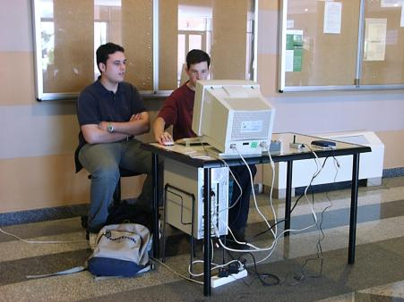 
    </td>
    <td width="40%">
      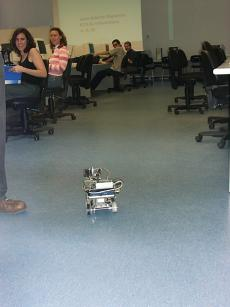 
    </td>
  </tr>
</table>

IV feria Madrid por la Ciencia (14-Feb-2003 en IFEMA)
==

Este año, la EPS era la encargada de representar a la UAM en la IV Feria Madrid por la Ciencia. Para nosotros era una oportunidad interesante de presentar nuestros robots y no dudamos en aprovechar la posibilidad de participar. [Presentamos](https://web.archive.org/web/20030819044019/http://www.ii.uam.es/~mecatron/index.php3?seccion=3&pagina=6) todos los robots disponibles en el CRM:

<table border="0" width="100%">
  <tr>
    <td width="22%">
       
       
    </td>
    <td width="46%">
       
    </td>
    <td width="32%">
       
    </td>
  </tr>
</table>

Fotos del evento y el artículo que apareció al día siguiente en la *Gaceta Universitaria*.

Alcabot 2002
==

 
Equipo: Antonio Carballo Antón, Luis Jorge Alloza Román, y Ramón Vazquez Pablo. Sostienen el robot velocista **MACH I**

ChampionBot 2001
==

Como alguien tenía que llevar a los robots al concurso ;P, el CRM estuvo representado en la [ChampionBot](https://web.archive.org/web/20031001234512id_/http://www.sia.eui.upm.es/championbot/) por [cuatro miembros](https://web.archive.org/web/20031027051833id_/http://www.ii.uam.es/~mecatron/index.php3?seccion=3&pagina=2) además del profesor Guillermo González de Rivera. Además de a Cortocircuito, nos llevamos a Bartolo para mostrarlo en la prueba libre. Como robot más representativo del CRM no podía faltar, y demostró a todos los asistentes su mal genio ;P

<table border="0" width="100%">
  <tr>
    <td width="40%">
       
    </td>
    <td width="30%">
       
    </td>
    <td width="30%">
       
    </td>
  </tr>
</table>

Curso de Robótica en 1999
==

A principios de Julio de 1999, recien acabados los exámenes de Junio, el club organizó un curso de una semana de duración orientado a la fabricación de un pequeño microrrobot. [El curso](https://web.archive.org/web/20040108031003id_/http://www.ii.uam.es/~mecatron/index.php3?seccion=6&pagina=1) tuvo un gran aceptación y tuvo lugar en el local que el club tenía en la antigua ubicación de la ETSI de Informática de la UAM en el módulo IV de la Escuela Universitaria de Profesorado Santa María.

<table border="0" width="100%">
  <tr>
    <td width="50%">
      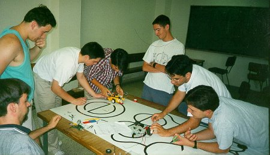 
    </td>
    <td width="50%">
      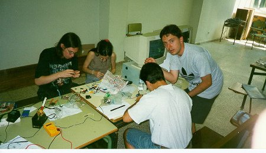 
    </td>
  </tr>
</table>

En definitiva el curso fue un éxito y sus integrantes mostraron gran satisfacción por el mismo. Basta decir que hasta nos ayudó a quitar gran parte de la inquietud de estar pendientes de las notas de los exámenes de Junio :)

 

Más actividades organizadas por el CRM:
--

* (2016) **Jornadas "ArduParty"**. Más información [en nuestro blog](../blog)

* (2016) **"Viernes abiertos"** del Club de Robótica. Más información [en nuestro blog](../blog)

* (2014) [**ArduParty 2014**](../actividades/2014_ArduParty), taller organizado por Víctor Uceda, Carlos García, Pablo Moreno y Miguel Rodríguez. *Escuela Politécnica Superior, 19 de Septiembre de 2014*

* (2013) [**Taller de iniciación a OpenScad**](https://github.com/carlosgs/tutorial-OpenScad) organizado por Carlos García. *Escuela Politécnica Superior, 3 de Octubre de 2013*

* (2012) [**Taller de introducción a la robótica con el robot HKTR-9000**](../actividades/2012_taller_arduino) organizado por Lucas Polo, Miguel Gargallo y Carlos García. Vinieron 20 estudiantes y se construyeron cinco robots capaces de seguir líneas y esquivar obstáculos. [vídeo 1](https://www.youtube.com/watch?v=4ZO9BoCVn4U), [vídeo 2](https://www.youtube.com/watch?v=QlhNiiyTSb0)

* (2011) **Taller de Arduino** organizado por Héctor Ménendez y Saúl Vargas. *Escuela Politécnica Superior, 4 de Noviembre de 2011*. ([PDF con documentación sobre Arduino](2011_ReferenciaArduinoCRM_hdmb.pdf))

* (2011) El CRM y el [Club de Informática](http://uam.es/cdi) ([archivo](https://web.archive.org/web/20171019084907/http://switch01.qui.uam.es/)) cooperan en el **Encuentro de Estudiantes por la Ciencia y la Cultura**. Fue organizado por David Camacho y Héctor Ménendez y tuvo un gran éxito entre los estudiantes (~80 personas). Además de las charlas educativas, destacaron los talleres de construcción de cohetes y de papiroflexia. *Escuela Politécnica Superior, 4-8 de Julio de 2011*. [noticia en la web de la UAM](https://web.archive.org/web/20120205124323/http://www.uam.es/ss/Satellite/es/1242652866332/1242655953936/cursocortaduracion/cursoCortaDuracion/Encuentro_de_Estudiantes_por_la_Ciencia_y_la_Cultura.htm)

Presencia del Club de Robótica en eventos frikis
--

* (2015) Participación en la [**V Jornada GMV de Robótica**](https://web.archive.org/web/20210801064059/http://www.gmv.com/es/Empresa/Comunicacion/NotasDePrensa/2015/NP_017_VJornadaRobotica.html). Primer premio en el concurso "Concurrent Design Facility (CDF) for Robotics". [Entrada en el blog](../blog/2015/11/26/VjornadaGMVrobotica.html)

* (2015) Participación del robot [CRMaze](https://github.com/CRM-UAM/CRMaze) (de Víctor Uceda y Carlos García) en el concurso de Laberinto de la [**Open Source Hardware Demonstration (OSHWDem 2015)**](http://oshwdem.org/category/ediciones-anteriores/oshwdem-2015/). *Domus de A Coruña, 7 de Noviembre de 2015*  

* (2013) Participación del robot Véctor 9000 (de Víctor Uceda y Carlos García) en la categoría Velocistas de **Cosmobot 2013**. *Museo de la Ciencia de Alcobendas, 3 de Marzo de 2013*  

* (2005-2008) Participación de miembros del CRM en las **Campus Party** [2005](http://www.iearobotics.com/personal/juan/eventos/evento03/), [2006](http://www.iearobotics.com/personal/juan/eventos/evento17/), [2007](http://www.iearobotics.com/blog/2007/07/24/campus-party-2007/), [2008](http://www.iearobotics.com/wiki/index.php?title=Campus_Party_2008) (Andrés Prieto Moreno, Juan González Gómez, Iván González...). El robot Slayer llegó a las semifinales del concurso de velocistas de la Campus Party 2008 ([vídeo](https://www.youtube.com/watch?v=QCTAsrCcZpA))  

* (2006) **ROBOLID'06**: El Club presentó dos robots, Slayer y Margarita. **Slayer ganó en la categoría de Rastreadores y Margarita fue quinto en la categoría de Sumo**. [**resumen en la web de ARDE**](http://www.arde.cc/competiciones/robolid-2006/), [**vídeo de Slayer**](https://www.youtube.com/watch?v=GXij8BVFPP0), [**vídeo de Margarita**](https://www.youtube.com/watch?v=l2qdEMfkfEo)  

* (2005) Participación en las **Sesiones de robótica UPSAM**. Andrés y Juan presentaron varios robots (el Skybot, los "ojos", Cube Revolutions, la Hormiga Benita, Pucho Bot, y el Robot "Observer"). [**diapositivas de la presentación**](../historia/eventos/2005_sesionesRoboticaUPSAM/)  

* (2005) Participación en **Robolid'05** con el robot Slayer (Daniel Álvarez y Alberto Calvo) en las categorías de rastreadores y velocistas. Más información [en el blog de iearobotics](http://www.iearobotics.com/personal/juan/conferencias/conf7/)

* (2004) **Concurso Nacional de robots HISPABOT'04**: [**resumen en la web iearobotics**](http://www.iearobotics.com/personal/juan/conferencias/conf14/), [**web Hispabot 04**](http://asimov.depeca.uah.es/alcabot/hispabot2004/), [**vídeo Queen-Mary**](https://www.youtube.com/watch?v=Af-piKdG3yk), [vídeo Slayer](https://www.youtube.com/watch?v=PIP5i6H5zKo), [**vídeo Melanie**](https://www.youtube.com/watch?v=cWKl-8FBR9Y) (UAH. Alcalá de Henares, Abril 2004). Participaron Cube-Revolutions, Queen-Mary, Papón y Melanie. **El CRM ganó los puestos 1º y 2º.**  

* (2002) **III Concurso de microrrobots de la Universidad de Alcalá, ALCABOT'02**: Participaron el rastreador Aragorn (por Luis Jorge Alloza Román y Ramón Vázquez Pablo), el velocista MACH I (por Antonio Carballo) y el sumo Sproket (por Ramón Vázquez Pablo). [**web alcabot**](http://asimov.depeca.uah.es/alcabot/alcabot2002/)

* (1997) **1º Torneo Abierto de Mecatrónica-Robótica de Madrid**: ([**web sumo**](https://web.archive.org/web/20041204060118/http://robotic-design.mister-i.com/sumo.html), [**web torneo**](https://web.archive.org/web/20041204060552/http://robotic-design.mister-i.com/torneo.html), [**vídeo torneo**](https://www.youtube.com/watch?v=ug1Dt8B3yGs), [**vídeo sumo**](https://www.youtube.com/watch?v=AXeh6zWayp8)) (Escuela Técnica Superior de Informática, Universidad Autónoma de Madrid, 28 de Octubre de 1997)  

*Créditos de las imágenes: La mayoría de las fotos pre-2009 han sido obtenidas del Internet Archive y de la web <http://iearobotics.com/>. Gracias a Juan González por recuperar las fotos de la feria "Madrid por la Ciencia"*

*¿Algún link roto? (webs, fotos, vídeos, etc). Recupéralo en [nuestro archivo](https://github.com/CRM-UAM/CRM-UAM.github.io/tree/master/historia) y [avísanos](../contacto).*  

*Estaríamos muy agradecidos de recibir más información (nuevos datos, vídeos, fotografías) o correcciones. Si dispones de ellos, por favor no dudes en [ponerte en contacto](../contacto) con nosotros.*  

