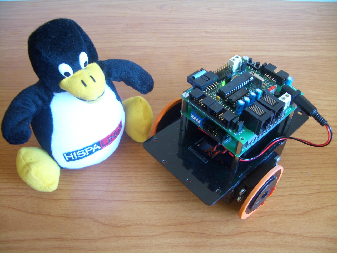

# Historia del GNB-UAM

**En construcción**  

* Rastreador Slayer, con tracción delantera y cabeza giratoria. (Daniel Alvarez y Alberto Calvo)  
  

* Queen-Mary, otro rastreador que usa Cds como ruedas (Daniel Álvarez y Alberto Calvo)  
  

* Skybot (Andrés Prieto-Moreno, Juan González Gómez, Ricardo Gómez)  
  

* Más robots:  

  

  

