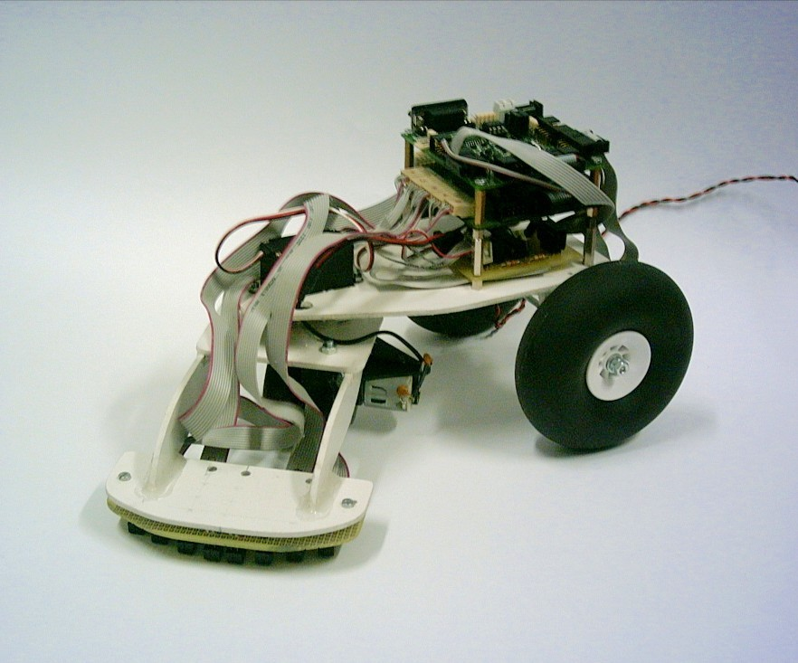

# Historia del CRM-UAM

El Club de Robótica-Mecatrónica se fundó en 1997 por estudiantes, con gran apoyo del profesor [Guillermo González de Rivera](http://arantxa.ii.uam.es/~gdrivera/). Entre los primeros miembros del CRM-UAM (período 1997-2010) estuvieron [Andrés Prieto Moreno](http://www.iearobotics.com/wiki/index.php?title=Andr%C3%A9s_Prieto-Moreno), [Juan González Gómez](http://www.iearobotics.com/wiki/index.php?title=Juan_Gonzalez:Main), Alberto Calvo, Daniel Álvarez, Antonio Carballo, [Iván González](http://arantxa.ii.uam.es/~igonzale/), entre otros.  
(PENDIENTE DE REDACCIÓN)  

Presencia del CRM en eventos frikis
--
* (2005-2008) Participación de miembros del CRM en las **Campus Party** [2005](http://www.iearobotics.com/personal/juan/eventos/evento03/), [2006](http://www.iearobotics.com/personal/juan/eventos/evento17/), [2007](http://www.iearobotics.com/blog/2007/07/24/campus-party-2007/), [2008](http://www.iearobotics.com/wiki/index.php?title=Campus_Party_2008) (Andrés Prieto Moreno, Juan González Gómez, Iván González, entre otros)

* (2006) Hispabot 
* (2006) **ROBOLID'06**: El Club presentó dos robots, Slayer y Margarita. **Slayer ganó en la categoría de Rastreadores y Margarita fue quinto en la categoría de Sumo**. [**resumen en la web de ARDE**](http://www.arde.cc/competiciones/robolid-2006/), [**vídeo de Slayer**](https://www.youtube.com/watch?v=GXij8BVFPP0), [**vídeo de Margarita**](https://www.youtube.com/watch?v=l2qdEMfkfEo)
* (2004) **Concurso Nacional de robots HISPABOT'04**: [**resumen en la web iearobotics**](http://www.iearobotics.com/personal/juan/conferencias/conf14/), [**web Hispabot 04**](http://asimov.depeca.uah.es/alcabot/hispabot2004/), [**vídeo Queen-Mary**](https://www.youtube.com/watch?v=Af-piKdG3yk), [vídeo Slayer](https://www.youtube.com/watch?v=PIP5i6H5zKo), [**vídeo Melanie**](https://www.youtube.com/watch?v=cWKl-8FBR9Y) (UAH. Alcalá de Henares, Abril 2004). Participaron Cube-Revolutions, Queen-Mary, Papón y Melanie. **Ganó los puestos 1º y 2º.**  
* (2002) **III Concurso de microrrobots de la Universidad de Alcalá, ALCABOT'02**: Participaron el rastreador Aragorn (por Luis Jorge Alloza Román y Ramón Vázquez Pablo), el velocista MACH I (por Antonio Carballo) y el sumo Sproket (por Ramón Vázquez Pablo). [**web alcabot**](http://asimov.depeca.uah.es/alcabot/alcabot2002/)
* (1997) **1º Torneo Abierto de Mecatrónica-Robótica de Madrid**: ([**web sumo**](http://robotic-design.mister-i.com/sumo.html), [**web torneo**](http://robotic-design.mister-i.com/torneo.html), [**vídeo**](https://www.youtube.com/watch?v=AXeh6zWayp8)) (Escuela Técnica Superior de Informática, Universidad Autónoma de Madrid, 28 de Octubre de 1997)  

*Estaríamos muy agradecidos de recibir más información (nuevos datos, vídeos, fotografías) o correcciones. Si dispones de ellos, por favor no dudes en [ponerte en contacto](https://groups.google.com/forum/#!forum/crm-uam) con nosotros.*

Algunos de los robots que han pasado por el CRM
--

* (2011) **ArduSnake** con cuerpo impreso en 3D (módulos [REPY1](http://www.thingiverse.com/thing:13442)) y electrónica donada por el diseñador Juan González (Obijuan). [**Foto de las piezas**](robots/2012_ArduSnake/2012-04-18 18.51.13_ImpresoraHalconMilenario.jpg) siendo fabricadas por [Halcón Milenario](http://www.reprap.org/wiki/Clone_wars:Impresora_Halc%C3%B3n_Milenario)  
  

* (2011) **PolillaBot** (Miguel Gargallo, Lucas Polo, Álvaro Pérez, Carlos Garcia)
  

* (2008) Robot [**FlatBot**](http://www.iearobotics.com/wiki/index.php?title=Robot_FlatBot) (Andrés Prieto-Moreno) Usado en el [Taller FlatBot](http://www.iearobotics.com/wiki/index.php?title=Taller_FlatBot) de la Campus Party 08

* (2008) Robot **Johny** para el concurso de robots Lego de la Campus Party 08
  

* (circa 2005) Rastreador **Slayer**, con tracción delantera y cabeza giratoria. **Ganador de la categoría rastreadores en Robolid'06**. (Daniel Álvarez y Alberto Calvo) Vídeos: [**Slayer en el CRM**](https://www.youtube.com/watch?v=koTuxa8mScI) ([**otro**](https://www.youtube.com/watch?v=BRsTaI17uao)), [**Slayer en la Campus Party 2008**](https://www.youtube.com/watch?v=QCTAsrCcZpA)  
  

* (2006) Robot de sumo **Margarita**, **5ª posición en Robolid'06**  
  

* (circa 2004) **Queen-Mary**, otro rastreador que usa CDs como ruedas (Daniel Álvarez y Alberto Calvo). [**Vídeo de Queen Mary en el CRM**](https://www.youtube.com/watch?v=7RbjuzbLHUs)  
  

* (2005) [**Skybot**](http://www.iearobotics.com/wiki/index.php?title=Skybot) (Andrés Prieto-Moreno, Juan González Gómez, Ricardo Gómez)  
  

* (2004) **Melanie**, [**Cube Revolutions**](http://www.iearobotics.com/wiki/index.php?title=Cube_Revolutions) y **Papón**  
  

* (circa 2004) Queen-Mary y robot anónimo:  
  

* (2002) **Mach I**, participante en Alcabot'02 (Antonio Carballo)  

# Fotos de los eventos

## Campus Party 2006

Alejandro Alonso (autor de Melanie) y Andrés Prieto Moreno. Todos los robots de la mesa han salido de la UAM. [**Vídeo de la oruga Benita (construida en 1996)**](https://www.youtube.com/watch?v=5pRC8NfJ7X0)  
  

Gedeón Domínguez e Iván González, modelo de frikies :-)  
  

## HISPABOT 2004

UAM-Team:  
  

Juan en la prueba libre  
  

Alberto y Queen-Mary  
  

Arturo, Daniel y Alberto  
  

## Alcabot 2002

Equipo: Antonio Carballo Anton, Luis Jorge Alloza Román, y Ramón Vazquez Pablo  
  

