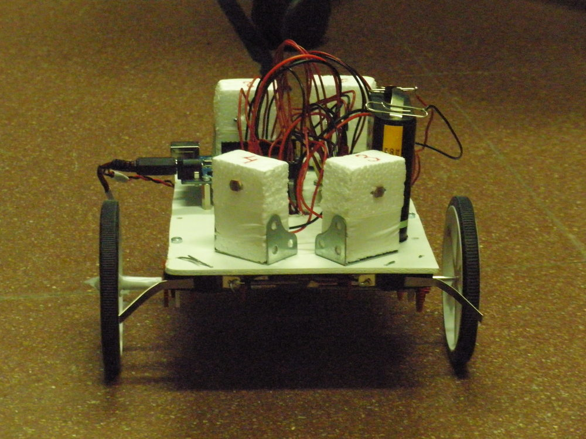
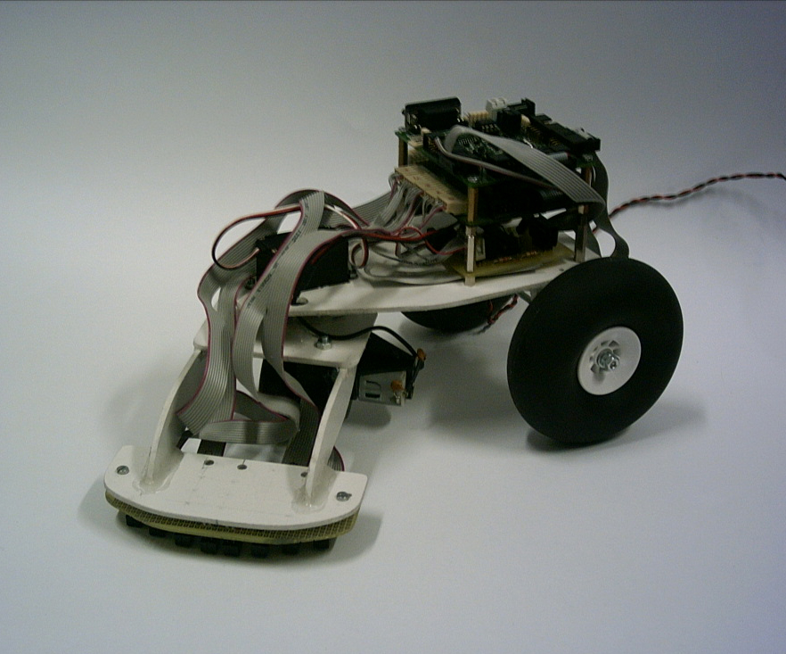
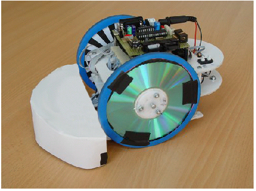
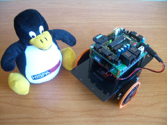
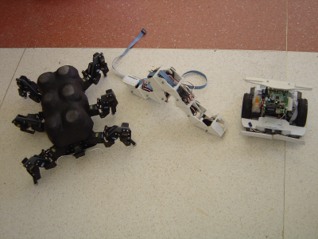
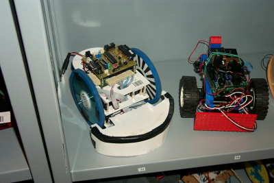

# Historia del CRM-UAM

Presencia del CRM en eventos pasados
--

* **1º Torneo Abierto de Mecatrónica-Robótica de Madrid** ([**web sumo**](1997_1erOpenMeca_sumo.html), [**web torneo**](1997_1erOpenMeca_torneo.html)) (Escuela Técnica Superior de Informática, Universidad Autónoma de Madrid, 28 de Octubre de 1997)  
* **Concurso Nacional de robots HISPABOT 2004** [**resumen en la web iearobotics**](2004_HISPABOT/2004_HISPABOT_iearobotics.html) (UAH. Alcalá de Henares, Abril 2004). Participaron Cube-Revolutions, Queen-Mary, Papón y Melanie  

Algunos de los robots que han pasado por el CRM
--

* **ArduSnake** con cuerpo impreso en 3D y electrónica donada por el diseñador Juan González (Obijuan)  
  

* **PolillaBot** (Miguel Gargallo, Lucas Polo, Álvaro Pérez, Carlos Garcia)
  

* Rastreador **Slayer**, con tracción delantera y cabeza giratoria. (Daniel Alvarez y Alberto Calvo)  
  

* **Queen-Mary**, otro rastreador que usa CDs como ruedas (Daniel Álvarez y Alberto Calvo)  
  

* [**Skybot**](http://www.iearobotics.com/wiki/index.php?title=Skybot) (Andrés Prieto-Moreno, Juan González Gómez, Ricardo Gómez, 2005)  
  

* **Melanie**, [**Cube Revolutions**](http://www.iearobotics.com/wiki/index.php?title=Cube_Revolutions) y **Papón** (2004)  
  

* Queen-Mary y robot anónimo:  
  

