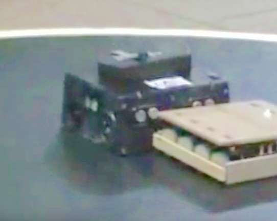

# Historia del CRM-UAM

El Club de Robótica-Mecatrónica se fundó en 1997 por estudiantes con gran apoyo del profesor [Guillermo González de Rivera](http://arantxa.ii.uam.es/~gdrivera/). Entre los primeros miembros del CRM-UAM estuvieron [Andrés Prieto Moreno](), [Juan González Gómez](), [Iván González](), etc  
(PENDIENTE DE REDACCIÓN)  

Presencia del CRM en eventos pasados
--

* (2006) Hispabot 
* (2006) **ROBOLID'06**: El Club presentó dos robots, Slayer y Margarita. Pues bien: Slayer ganó en la categoría de Rastreadores y Margarita fue quinto en la categoría de Sumo. [**resumen en la web de ARDE**](http://www.arde.cc/competiciones/robolid-2006/), [**vídeo de Slayer**](https://www.youtube.com/watch?v=GXij8BVFPP0), [**vídeo de Margarita**](https://www.youtube.com/watch?v=l2qdEMfkfEo)
* (2004) **Concurso Nacional de robots HISPABOT'04**: [**resumen en la web iearobotics**](eventos/2004_HISPABOT/2004_HISPABOT_iearobotics.html) (UAH. Alcalá de Henares, Abril 2004). Participaron Cube-Revolutions, Queen-Mary, Papón y Melanie. **Ganó los puestos 1º y 2º.**  
* (2002) **III Concurso de microrrobots de la Universidad de Alcalá, ALCABOT'02**: Participaron el rastreador Aragorn (por Luis Jorge Alloza Román y Ramón Vázquez Pablo), el velocista MACH I (por Antonio Carballo) y el sumo Sproket (por Ramón Vázquez Pablo). [**web alcabot**](http://asimov.depeca.uah.es/alcabot/alcabot2002/)
* (1997) **1º Torneo Abierto de Mecatrónica-Robótica de Madrid**: ([**web sumo**](eventos/1997_1erOpenMeca_sumo.html), [**web torneo**](1997_1erOpenMeca_torneo.html)) (Escuela Técnica Superior de Informática, Universidad Autónoma de Madrid, 28 de Octubre de 1997)  

Algunos de los robots que han pasado por el CRM
--

* **ArduSnake** con cuerpo impreso en 3D (módulos [REPY1](http://www.thingiverse.com/thing:13442)) y electrónica donada por el diseñador Juan González (Obijuan)  
  

* **PolillaBot** (Miguel Gargallo, Lucas Polo, Álvaro Pérez, Carlos Garcia)
  

* Rastreador **Slayer**, con tracción delantera y cabeza giratoria. **Ganador de la categoría rastreadores en Robolid'06**. (Daniel Alvarez y Alberto Calvo)  
  

* Robot de sumo **Margarita**, **5ª posición en Robolid'06**  
  

* **Queen-Mary**, otro rastreador que usa CDs como ruedas (Daniel Álvarez y Alberto Calvo)  
  

* [**Skybot**](http://www.iearobotics.com/wiki/index.php?title=Skybot) (Andrés Prieto-Moreno, Juan González Gómez, Ricardo Gómez, 2005)  
  

* **Melanie**, [**Cube Revolutions**](http://www.iearobotics.com/wiki/index.php?title=Cube_Revolutions) y **Papón** (2004)  
  

* Queen-Mary y robot anónimo:  
  

* **Mach I**, participante en Alcabot 2002 (Antonio Carballo)  

# Fotos de los eventos

## HISPABOT 2004

UAM-Team:
  

Juan en la prueba libre  
  

Alberto y Queen-Mary  
  

Arturo, Dani y Alberto
  

## Alcabot 2002

Equipo: Antonio Carballo Anton, Luis Jorge Alloza Román, y Ramón Vazquez Pablo  
  

