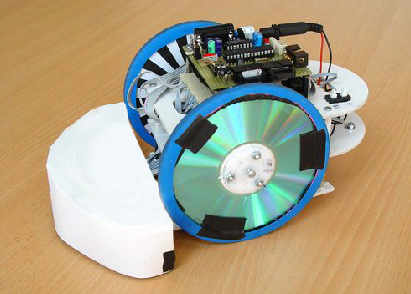
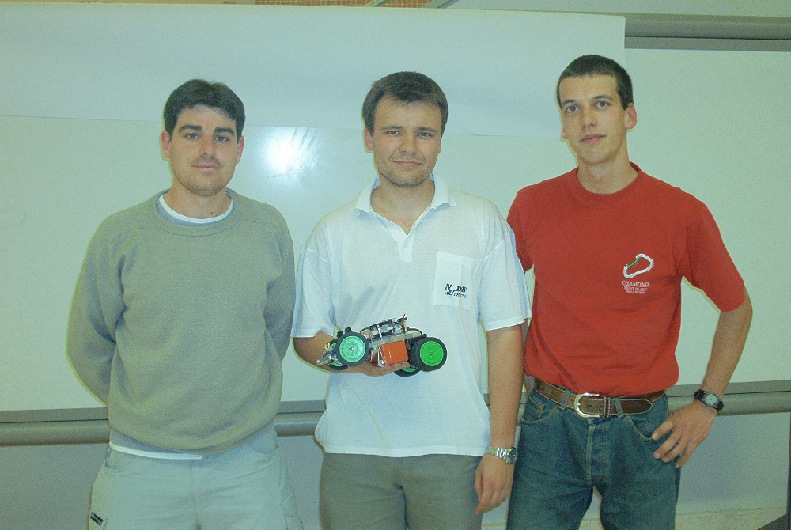

El Club de Robótica-Mecatrónica (CRM) fue fundado en 1997 por estudiantes de la [Universidad Autónoma de Madrid](http://www.uam.es/), con gran apoyo del profesor [Guillermo González de Rivera](http://arantxa.ii.uam.es/~gdrivera/). Entre los primeros miembros del CRM-UAM (período 1997-2008) estuvieron [Andrés Prieto Moreno](http://www.iearobotics.com/wiki/index.php?title=Andr%C3%A9s_Prieto-Moreno), [Juan González Gómez](http://www.iearobotics.com/wiki/index.php?title=Juan_Gonzalez:Main), Juan Manuel Zapata, Alberto Calvo, Daniel Álvarez, Antonio Carballo e [Iván González](http://arantxa.ii.uam.es/~igonzale/), entre otros.  

De 2009 a 2011 fue [Héctor David Ménendez](http://aida.ii.uam.es/researchers/facultystaff/hector-d-menendez) quien tomó las riendas de la asociación, reabriendo el club y promoviendo multitud de talleres de Arduino e iniciativas tan interesantes como el *Encuentro de Estudiantes por la Ciencia y la Cultura* (organizado junto con [David Camacho Fernández](http://aida.ii.uam.es/researchers/facultystaff/camacho-david)).  

Desde entonces el CRM-UAM lo han administrado las siguientes juntas directivas:  

<table border="1px" width="100%">
  <tr>
    <th>Curso</th>
    <th>Presidente</th>
    <th>Vice-pres.</th>
    <th>Secretario</th>
    <th>Tesorero</th>
    <th>Vocales</th>
  </tr>
  <tr>
    <td><i>2012-13</i></td>
    <td>Miguel Gargallo</td> <!--Presidente-->
    <td><a href="http://lucaspolo.eu">Lucas Polo</a></td> <!--Vice-presidente-->
    <td>Antonio Ortega</td> <!--Secretario-->
    <td>Antonio Ortega</td> <!--Tesorero-->
    <td>Álvaro Pérez Carlos García</td> <!--Vocales-->
  </tr>
  <tr>
    <td><i>2013-14</i></td>
    <td>Miguel Gargallo</td> <!--Presidente-->
    <td>Carlos García</td> <!--Vice-presidente-->
    <td>Pablo Molins</td> <!--Secretario-->
    <td>Víctor Uceda</td> <!--Tesorero-->
    <td></td> <!--Vocales-->
  </tr>
  <tr>
    <td><i>2014-15</i></td>
    <td>Víctor Uceda</td> <!--Presidente-->
    <td>Rodrigo Jiménez</td> <!--Vice-presidente-->
    <td>Cristina Kasner</td> <!--Secretario-->
    <td>Guillermo Ruíz</td> <!--Tesorero-->
    <td></td> <!--Vocales-->
  </tr>
  <tr>
    <td><i>2015-16</i></td>
    <td>Carlos García</td> <!--Presidente-->
    <td>Rodrigo Jiménez</td> <!--Vice-presidente-->
    <td>Cristina Kasner</td> <!--Secretario-->
    <td>Jaime Aragón</td> <!--Tesorero-->
    <td>Víctor Uceda Pablo Molins</td> <!--Vocales-->
  </tr>
</table>
 

A pesar de ser una asociación gestionada por estudiantes, **el Club de Robótica-Mecatrónica apoya a cualquier miembro de la comunidad universitaria que quiera llevar a cabo proyectos relacionados con la robótica**.
Es decir, tanto estudiantes como profesores pueden inscribirse y así disponer de un espacio de trabajo agradable con herramientas de uso común (impresoras 3D, soldadores, sierras, alicates, destornilladores, etc) así como los materiales necesarios (cables, componentes, motores, baterías, etc). También disponemos de un [foro](../contacto) donde ayudarnos unos a otros.

Además el club organiza periódicamente diversas [actividades](../actividades) para fomentar la robótica entre los estudiantes.  

Presencia del Club de Robótica en eventos frikis
--

* (2015) Participación en la [**V Jornada GMV de Robótica**](http://www.gmv.com/es/Empresa/Comunicacion/NotasDePrensa/2015/NP_017_VJornadaRobotica.html). Primer premio en el concurso "Concurrent Design Facility (CDF) for Robotics". [Entrada en el blog](/blog/2015/11/26/VjornadaGMVrobotica.html)

* (2015) Participación del robot [CRMaze](https://github.com/CRM-UAM/CRMaze) (de Víctor Uceda y Carlos García) en el concurso de Laberinto de la [**Open Source Hardware Demonstration (OSHWDem 2015)**](http://oshwdem.org/category/ediciones-anteriores/oshwdem-2015/). *Domus de A Coruña, 7 de Noviembre de 2015*  

* (2013) Participación del robot Véctor 9000 (de Víctor Uceda y Carlos García) en la categoría Velocistas de **Cosmobot 2013**. *Museo de la Ciencia de Alcobendas, 3 de Marzo de 2013*  

* (2005-2008) Participación de miembros del CRM en las **Campus Party** [2005](http://www.iearobotics.com/personal/juan/eventos/evento03/), [2006](http://www.iearobotics.com/personal/juan/eventos/evento17/), [2007](http://www.iearobotics.com/blog/2007/07/24/campus-party-2007/), [2008](http://www.iearobotics.com/wiki/index.php?title=Campus_Party_2008) (Andrés Prieto Moreno, Juan González Gómez, Iván González...). El robot Slayer llegó a las semifinales del concurso de velocistas de la Campus Party 2008 ([vídeo](https://www.youtube.com/watch?v=QCTAsrCcZpA))  

* (2006) **ROBOLID'06**: El Club presentó dos robots, Slayer y Margarita. **Slayer ganó en la categoría de Rastreadores y Margarita fue quinto en la categoría de Sumo**. [**resumen en la web de ARDE**](http://www.arde.cc/competiciones/robolid-2006/), [**vídeo de Slayer**](https://www.youtube.com/watch?v=GXij8BVFPP0), [**vídeo de Margarita**](https://www.youtube.com/watch?v=l2qdEMfkfEo)  

* (2005) Participación en las **Sesiones de robótica UPSAM**. Andrés y Juan presentaron varios robots (el Skybot, los "ojos", Cube Revolutions, la Hormiga Benita, Pucho Bot, y el Robot "Observer"). [**diapositivas de la presentación**](/historia/eventos/2005_sesionesRoboticaUPSAM/)  

* (2004) **Concurso Nacional de robots HISPABOT'04**: [**resumen en la web iearobotics**](http://www.iearobotics.com/personal/juan/conferencias/conf14/), [**web Hispabot 04**](http://asimov.depeca.uah.es/alcabot/hispabot2004/), [**vídeo Queen-Mary**](https://www.youtube.com/watch?v=Af-piKdG3yk), [vídeo Slayer](https://www.youtube.com/watch?v=PIP5i6H5zKo), [**vídeo Melanie**](https://www.youtube.com/watch?v=cWKl-8FBR9Y) (UAH. Alcalá de Henares, Abril 2004). Participaron Cube-Revolutions, Queen-Mary, Papón y Melanie. **El CRM ganó los puestos 1º y 2º.**  

* (2002) **III Concurso de microrrobots de la Universidad de Alcalá, ALCABOT'02**: Participaron el rastreador Aragorn (por Luis Jorge Alloza Román y Ramón Vázquez Pablo), el velocista MACH I (por Antonio Carballo) y el sumo Sproket (por Ramón Vázquez Pablo). [**web alcabot**](http://asimov.depeca.uah.es/alcabot/alcabot2002/)

* (1997) **1º Torneo Abierto de Mecatrónica-Robótica de Madrid**: ([**web sumo**](http://robotic-design.mister-i.com/sumo.html), [**web torneo**](http://robotic-design.mister-i.com/torneo.html), [**vídeo torneo**](https://www.youtube.com/watch?v=ug1Dt8B3yGs), [**vídeo sumo**](https://www.youtube.com/watch?v=AXeh6zWayp8)) (Escuela Técnica Superior de Informática, Universidad Autónoma de Madrid, 28 de Octubre de 1997)  

Algunos de los robots que han pasado por el CRM
--

* (2013) **Véctor 9000** (Víctor Uceda, Carlos García) Participante en Cosmobot'13, categoría velocistas. *La categoría velocistas consiste en trazar en el suelo una línea cerrada que deben seguir los robots. Gana el robot que complete el recorrido en el menor tiempo posible*. [**vídeo**](https://www.youtube.com/watch?v=wgSMBDEtGO0)  

 

* (2012) **HKTR-9000** (Lucas Polo, Miguel Gargallo, Carlos García) Diseñado a partir del PolillaBot y utilizado en el [Taller de introducción a la robótica 2012](../actividades/2012_taller_arduino). El nombre HKTR (*Héctor*) es en honor de Héctor Ménendez, ex-presidente del CRM-UAM. *El HKTR-9000 dispone de sensores de línea, de luz, y de distancia, así como LEDs y un altavoz. De este modo se puede programar para seguir fuentes luminosas, esquivar obstáculos y seguir una línea trazada en el suelo.*  

 

* (2011) **ArduSnake**, un robot modular de tipo "serpiente" con el cuerpo impreso en 3D (módulos [REPY1](http://www.thingiverse.com/thing:13442)) y electrónica donada por el diseñador Juan González (Obijuan). [**Foto de las piezas**](robots/2012_ArduSnake/2012-04-18 18.51.13_ImpresoraHalconMilenario.jpg) siendo fabricadas por [Halcón Milenario](http://www.reprap.org/wiki/Clone_wars:Impresora_Halc%C3%B3n_Milenario)  

 

* (2011) **PolillaBot** (Miguel Gargallo, Lucas Polo, Álvaro Pérez, Carlos Garcia). *Éste robot nos sirvió de iniciación a los sensores de luz, su función era dirigirse hacia las fuentes luminosas situadas a su alrededor*  

 

* (2008) Robot [**FlatBot**](http://www.iearobotics.com/wiki/index.php?title=Robot_FlatBot) (Andrés Prieto-Moreno). Utilizado en el [Taller FlatBot](http://www.iearobotics.com/wiki/index.php?title=Taller_FlatBot) de la Campus Party 08. *Como puede apreciarse, se trata de una plataforma móvil donde situar un ordenador portátil a modo de "cerebro" controlador del robot*  

 

* (2008) Robot **Johny** para el concurso de robots Lego de la Campus Party 08  

 

* (2005) Rastreador **Slayer**, con tracción delantera y cabeza giratoria. **Ganador de la categoría rastreadores en Robolid'06**. (Daniel Álvarez y Alberto Calvo) Vídeos: [**en el CRM (I)**](https://www.youtube.com/watch?v=koTuxa8mScI), [**en el CRM (II)**](https://www.youtube.com/watch?v=BRsTaI17uao), [**en la Campus Party'08**](https://www.youtube.com/watch?v=QCTAsrCcZpA)  

 

* (2006) Robot de sumo **Margarita**, **5ª posición en Robolid'06**. *El objetivo de la categoría "sumo" es expulsar al robot contrincante del ring*. ([video](https://www.youtube.com/watch?v=l2qdEMfkfEo))  

 

* (circa 2004) **Queen-Mary**, otro rastreador que usa CDs como ruedas (Daniel Álvarez y Alberto Calvo). [**Vídeo de Queen Mary en el CRM**](https://www.youtube.com/watch?v=7RbjuzbLHUs)  

 

* (2005) [**Skybot**](http://www.iearobotics.com/wiki/index.php?title=Skybot) (Andrés Prieto-Moreno, Juan González Gómez, Ricardo Gómez). Utilizado en multitud de talleres docentes en la Universidad Autónoma de Madrid y en eventos de la Campus Party. Robot antecesor del [**MiniSkyBot**](http://www.thingiverse.com/thing:7989), **el primer robot libre e imprimible del mundo**.  

 

* (2004) Hexápodo **Melanie**, [**Cube Revolutions**](http://www.iearobotics.com/wiki/index.php?title=Cube_Revolutions) (un robot modular de tipo oruga) y **Papón**.  

 

* (circa 2004) Queen-Mary y robot anónimo. Ambos son robots seguidores de línea. [vídeo de Queen Mary en Hispabot'04](https://www.youtube.com/watch?v=Af-piKdG3yk)  

 

* (2002) **Mach I**, un robot seguidor de línea, participante en Alcabot'02 (Antonio Carballo)  

 

Fotos de los eventos en los que hemos estado
--

Feria de las Asociaciones de la UAM 2015 (EPS Cantoblanco)
==

 
<a href="/blog/2015/12/15/FeriaDeLasAsociacionesUAM.html"><b>Entrada en nuestro blog</b></a>

V Jornada GMV de Robótica 2015 (Tres Cantos)
==

<table border="0" width="100%">
  <tr>
    <td>
       
      Demostración de los robots <i>Foxiris</i> de GMV (izquierda), <i>MiR100</i> de Robotplus (al fondo) y <i>Aunav</i> de Proytecsa (derecha). <a href="/blog/2015/11/26/VjornadaGMVrobotica.html"><b>Entrada en nuestro blog</b></a>
    </td>
    <td>
       
      Miembros del CRM ganaron el concurso <i>"Concurrent Design Facility (CDF) for Robotics"</i> junto con estudiantes de la UPM.
    </td>
  </tr>
</table>

OSHWDem 2015 (A Coruña)
==

<table border="0" width="100%">
  <tr>
    <td>
       
    </td>
    <td>
       
    </td>
    <td>
       
    </td>
  </tr>
</table>

Víctor y Carlos construyeron el robot [**CRMaze**](https://github.com/CRM-UAM/CRMaze) para participar en el concurso de resolución de laberintos (*"micromouse"*) de la OSHWDem 2015. [**Entrada en nuestro blog**](/blog/2015/11/07/OSHWDem.html)

Campus Party EU 2013 (Londres)
==

<table border="0" width="100%">
  <tr>
    <td>
       
      A la izquierda Ángel Pérez, y a la derecha Víctor Uceda y Erik Velasco
    </td>
    <td>
       
      Miembros del CRM ganaron el mini-concurso de robótica VEX
    </td>
  </tr>
</table>

Cosmobot 2013 (Alcobendas)
==

 
Juan González, que vino a visitarnos, y el UAM-Team: Carlos García y Víctor Uceda. El robot es el velocista [Véctor 9000](https://www.youtube.com/watch?v=wgSMBDEtGO0)

Campus Party 2006
==

<table border="0" width="100%">
  <tr>
    <td>
       
       
    </td>
    <td>
       
    </td>
  </tr>
</table>

Sup-izq: Alejandro Alonso (autor de Melanie) y Andrés Prieto Moreno. [**Vídeo de la Hormiga Benita (construida en 1996)**](https://www.youtube.com/watch?v=5pRC8NfJ7X0). Inf-Izq: Gedeón Domínguez e Iván González. Derecha: Desconocido, Alberto Calvo, Francisco Reinoso "Furri" y Alejandro Alonso.  

[Primer vídeo en YouTube de la Campus Party 2006](https://www.youtube.com/watch?v=ehymwnycVmg) por Gedeón Domínguez (se ve en primer plano a Juan González).  

HISPABOT 2004
==

<table border="0" width="100%">
  <tr>
    <td>
       
      Juan en la prueba libre con <a href="http://www.iearobotics.com/wiki/index.php?title=Cube_Revolutions">Cube Revolutions</a>
    </td>
    <td>
       
      Arturo, Daniel y Alberto
    </td>
    <td>
       
      Alberto y Queen-Mary
    </td>
  </tr>
</table>

 
UAM-Team: En la derecha están Alejandro, Juan, el grupo Papón, Ramón y Cristina que se pasaron para ver el concurso (ellos participaron el año anterior, también en la prueba libre). En la parte inferior de la foto se ven los robots robot Hexápodo Melanie , Cube Revolutions y Papón.

IV feria Madrid por la Ciencia (14-Feb-2003 en IFEMA)
==

<table border="0" width="100%">
  <tr>
    <td>
       
       
    </td>
    <td>
       
    </td>
    <td>
       
    </td>
  </tr>
</table>

Fotos del evento y el artículo que apareció al día siguiente en la *Gaceta Universitaria*.

Alcabot 2002
==

 
Equipo: Antonio Carballo Antón, Luis Jorge Alloza Román, y Ramón Vazquez Pablo. Sostienen el robot velocista **MACH I**

 

*Créditos de las imágenes: La mayoría de las fotos pre-2009 han sido obtenidas de la web <http://iearobotics.com/>. Gracias a Juan González por recuperar las fotos de la feria "Madrid por la Ciencia"*

*¿Algún link roto? (webs, fotos, vídeos, etc). Recupéralo en [nuestro archivo](https://github.com/CRM-UAM/CRM-UAM.github.io/tree/master/historia) y [avísanos](../contacto).*  

*Estaríamos muy agradecidos de recibir más información (nuevos datos, vídeos, fotografías) o correcciones. Si dispones de ellos, por favor no dudes en [ponerte en contacto](../contacto) con nosotros.*  

