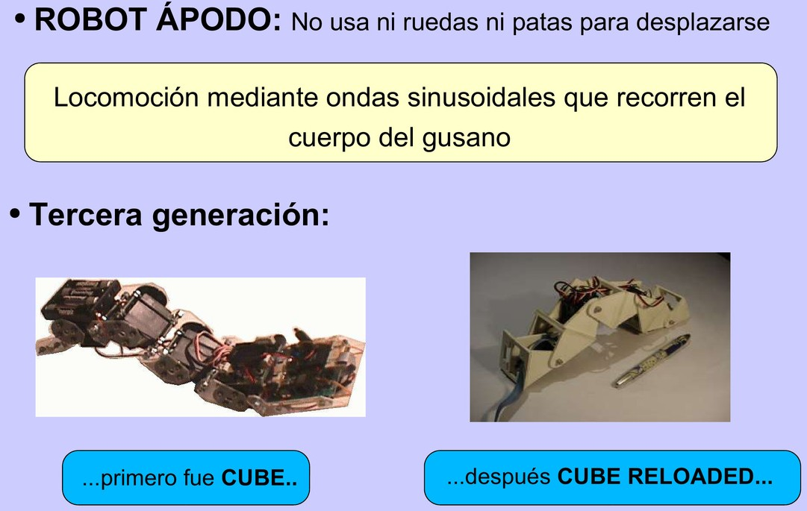
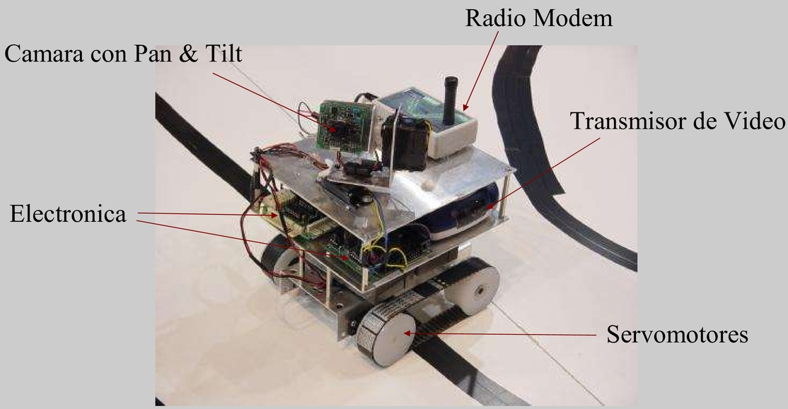
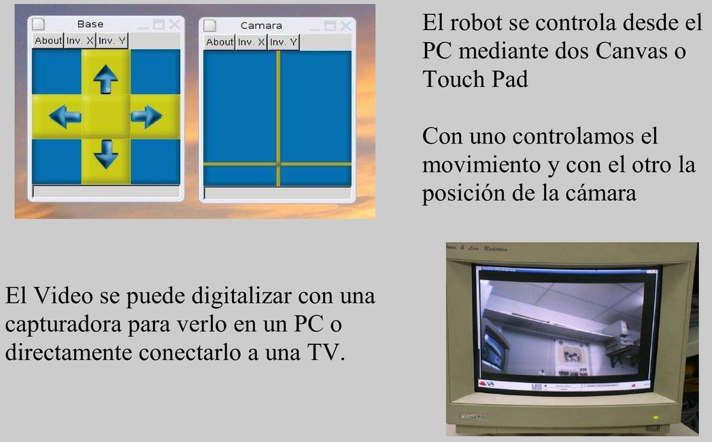

[Descargar diapositivas en PDF](2005_robotica-upsam-abr-05-sesion1.pdf)  

 

 
 

Skybot
--
 
 
 

Los Ojos
--
 
 
 

Cube Revolutions
--
 
 
 

La Hormiga Benita
--
 
 

[**Vídeo de la Hormiga Benita (construida en 1996)**](https://www.youtube.com/watch?v=5pRC8NfJ7X0)  

 

Pucho Bot
--
 
 
 
 

Robot "Observer"
--
 
 
 

