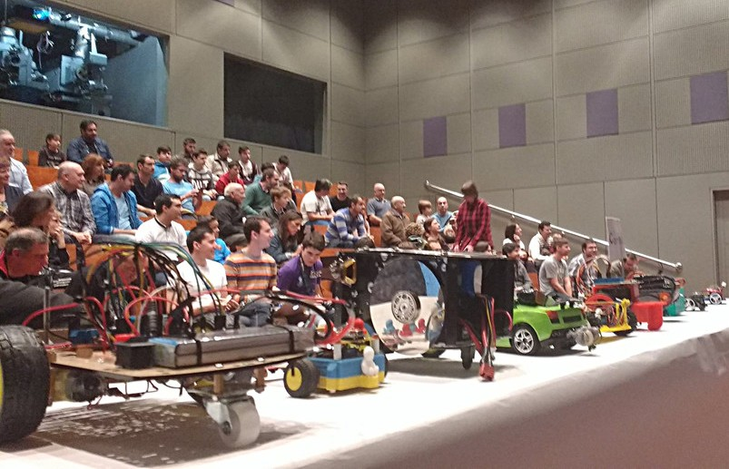

El público expectante, frente a los robots a punto de empezar la competición de siguelíneas.

Víctor Uceda participando con nuestro velocista ["MiniVector"](https://github.com/CRM-UAM/Vector9000/blob/master/3D_design/STL/Chasis_v2_corto.stl).

Víctor y Carlos participando con el robot laberinto ["DELS (¿Dónde Está la Salida?"](https://github.com/CRM-UAM/micromouse-DELS).

Eduardo Hilario controlando el robot de combate "Cuñaobot". Lo terminamos de programar cinco minutos antes de la competición, y se controlaba **por SSH y comandos de teclado**. Aun así quedó en segundo puesto.

Durante el combate se aflojó un motor y hubo que desmontar la caja de engranajes... ¡a contrarreloj, porque se acababa el tiempo para volver a competir!

SuperMecanico (Luis Llamas), Cuñaobot (CRM), y Scratch (Alex @TCrobotics) luchando en el combate de robots.

La entrega de los premios de combate la realizaron las fuerzas imperiales. De izquierda a derecha Darth Vader, AlexTC, Antonio Regueira, Luis Llamas, Carlos García y Eduardo Hilario.

El UAM-TEAM junto a la Torre de Hércules.

Los trofeos conseguidos, ya colocados en el local del club de robótica.

Nuestro grupo muy motivado tras la OSHWDem. Víctor Uceda, Pablo Molins, Carlos González "Chache", Carlos García, Alfredo Sanz y Eduardo Hilario.

Conclusión de la OSHWDem 2016: ¡¡El año que viene por fin resolveremos el laberinto, sí o sí!! ;-)

Algunos vídeos
--
- [Robots de combate](https://www.youtube.com/watch?v=y7-bAhUAHf8)
- [Desafío laberinto](https://www.youtube.com/watch?v=HLExTU7jR8g)
- [Robots sigue-líneas](https://www.youtube.com/watch?v=7GXjH3vUWNU)
- [Time-lapse de las competiciones](https://www.youtube.com/watch?v=HzSNfapy_Lk)

- [Resumen OSHWDem 2016 BricoGeek](https://www.youtube.com/watch?v=z0bdC4cat_Y)
- [Resumen fotografico de dev.4m1g0](https://www.youtube.com/watch?v=ZEo4uUONxGg)
