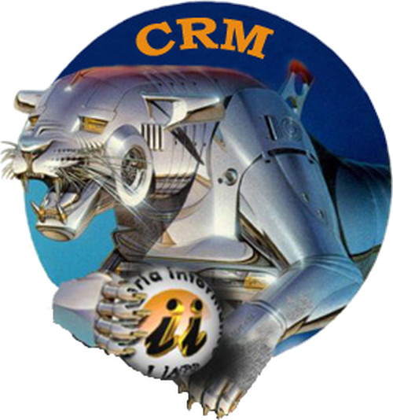
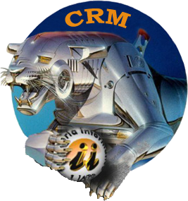
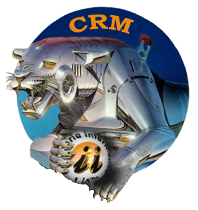
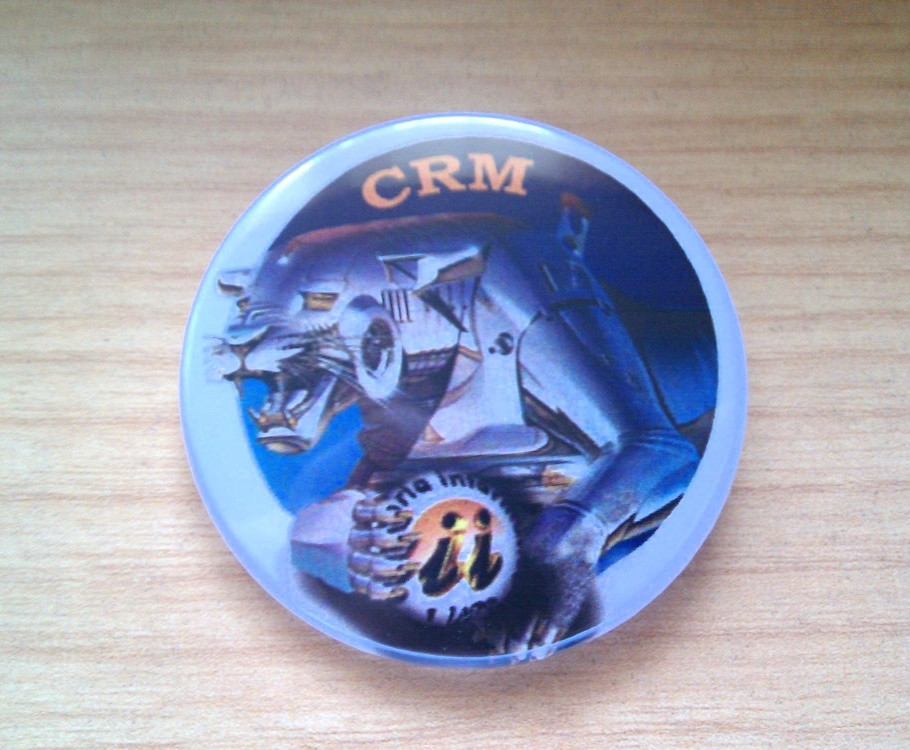

# Logo oficial del Club de Robótica y Mecatrónica

Para documentos de texto
--
Logo en JPEG:  
  

Logo en PNG, con el fondo transparente:  
  

Para presentaciones
--
Logo en PNG, transparente con el borde sombreado en blanco:  
  

Para fabricar chapas
--
Ficheros ([PDF](chapas/logo_crm_chapas.pdf), [ODG](chapas/logo_crm_chapas.odg)) para imprimir chapas como ésta:  
  

Origen del logo
==
Aunque desconocemos el autor original del logo, sabemos que se basó en la siguiente obra de la colección [**"animals"**](http://www.russianpaintings.net/russian_paintings.vphp?author=971&sort=size) del ilustrador japonés [**Hajime Sorayama**](https://en.wikipedia.org/wiki/Hajime_Sorayama):  
  
*Animal. #15* by Hajime Sorayama  

