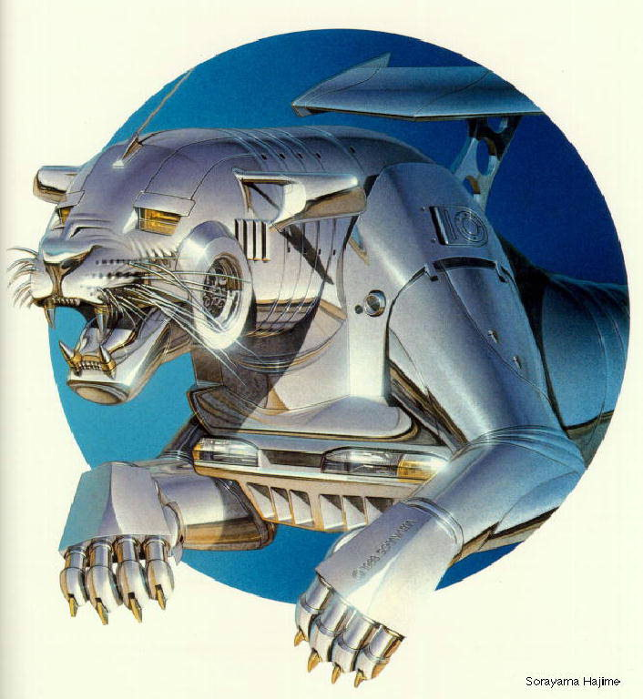

Para presentaciones:
==
  
[.png](logo_crm_transparente_con_sombra.png) (transparente con el borde sombreado en blanco)  

Para documentos de texto:
==
[.jpg](logo_crm_fondoBlanco.jpg) (fondo blanco)  
[.png](logo_crm_transparente.png) (fondo transparente, sin sombra)  

Para la web:
==
Logos muy comprimidos, con fondo transparente:  

  

[.png 192px](logo_crm-192x192.png) \| [.ico multi-res {16,32,48,64}px](/favicon.ico)  

Para fabricar chapas:
==
Ficheros ([PDF](chapas/logo_crm_chapas.pdf), [ODG](chapas/logo_crm_chapas.odg)) para imprimir en A4 y fabricar chapas como ésta:  
  

Origen del logotipo
--
Aunque desconocemos el autor original del logotipo, sabemos que se basó en la siguiente obra de la colección [**"animals"**](http://www.russianpaintings.net/russian_paintings.vphp?author=971&sort=size) del ilustrador japonés [**Hajime Sorayama**](https://en.wikipedia.org/wiki/Hajime_Sorayama):  
  
*Animal. #15* by Hajime Sorayama  

