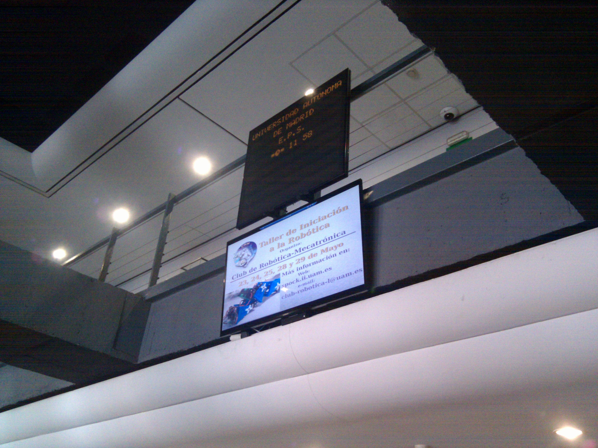
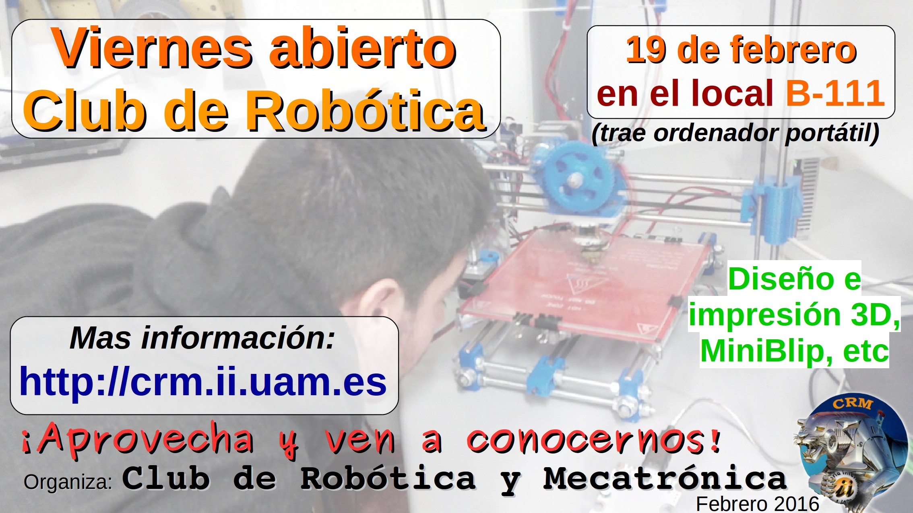
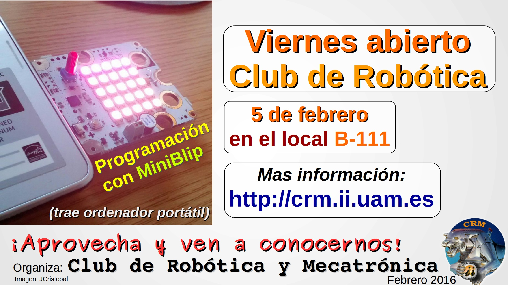
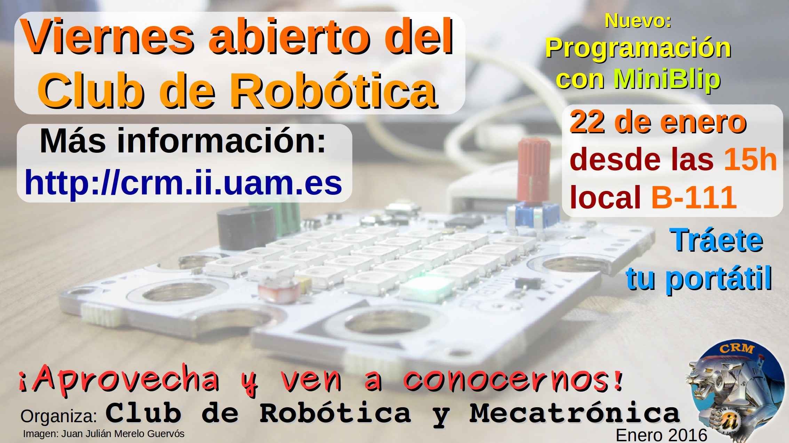
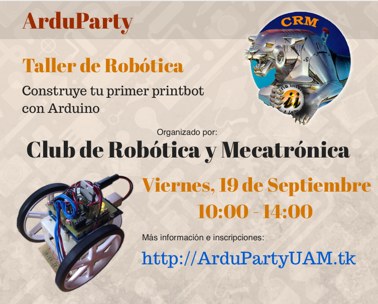
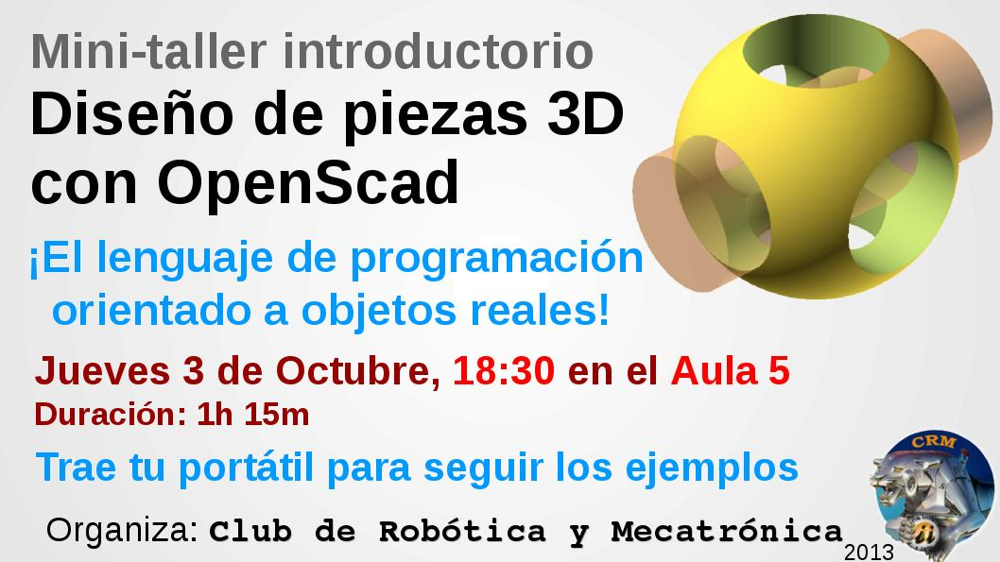
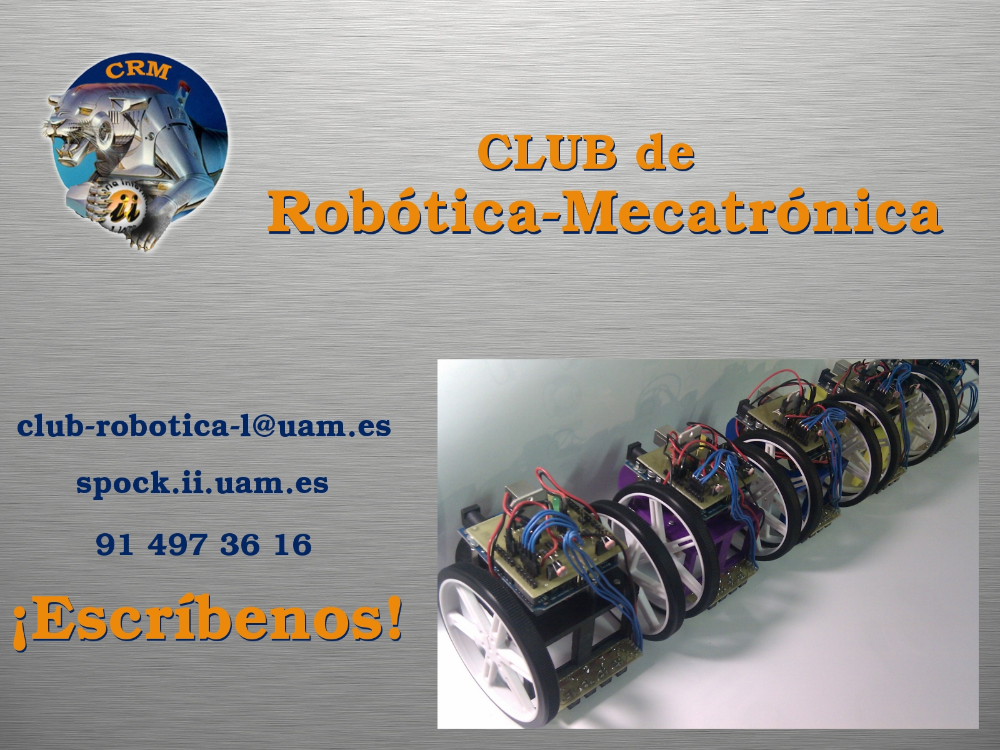
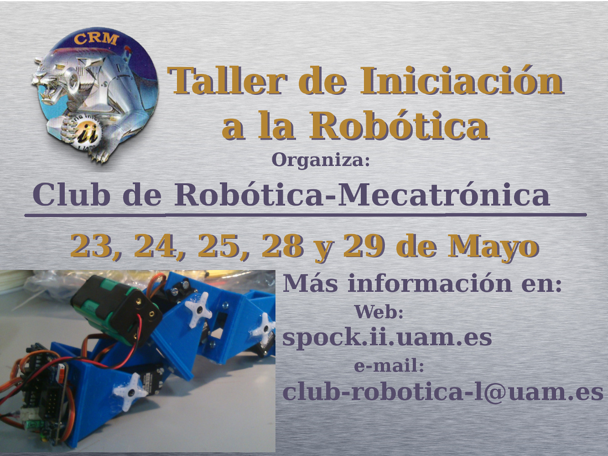
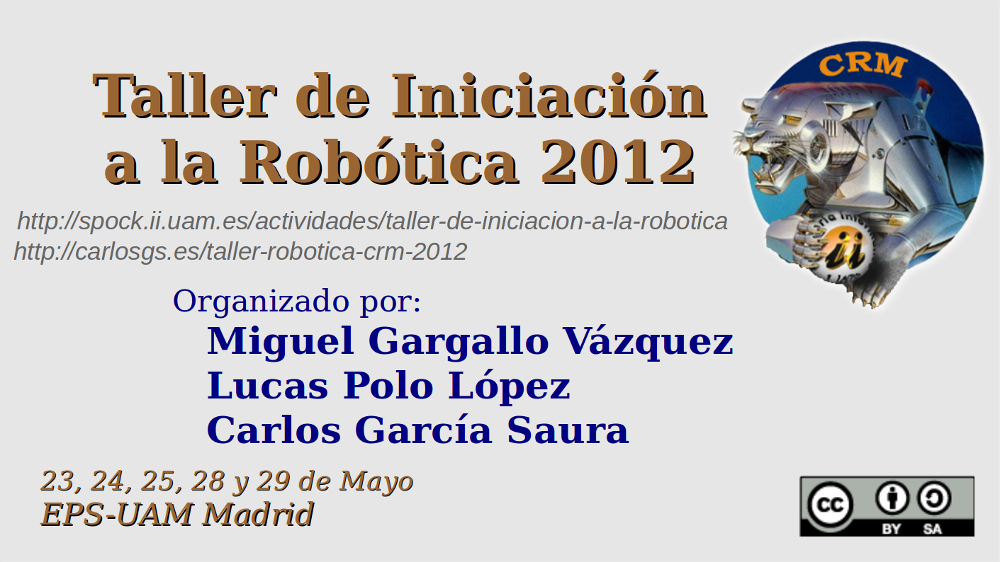

Plantillas para promocionar los eventos del club con "spamming" del bueno :-)  
  
Diseñadas por Lucas Polo, Víctor Uceda y Carlos García  

 
<a href="2016_Cartel_viernesAbierto19febrero.odp">fuente ODP</a>

 
<a href="2016_Cartel_viernesAbierto5febrero.odp">fuente ODP</a>

 
<a href="2016_Cartel_viernesAbierto22enero.odp">fuente ODP</a>

 

 
<a href="2013_Cartel_Taller_OpenScad.odp">fuente ODP</a>

 

 

 
<a href="2012_taller_iniciacion.odg">fuente ODG</a>

